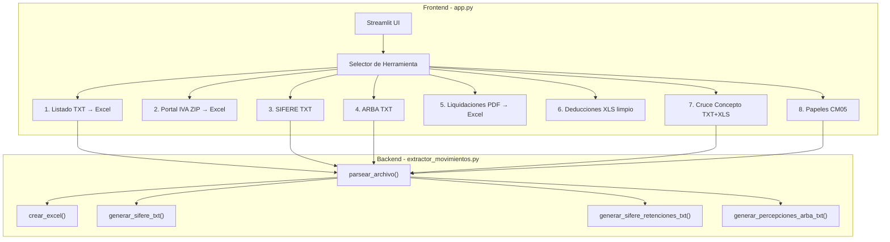
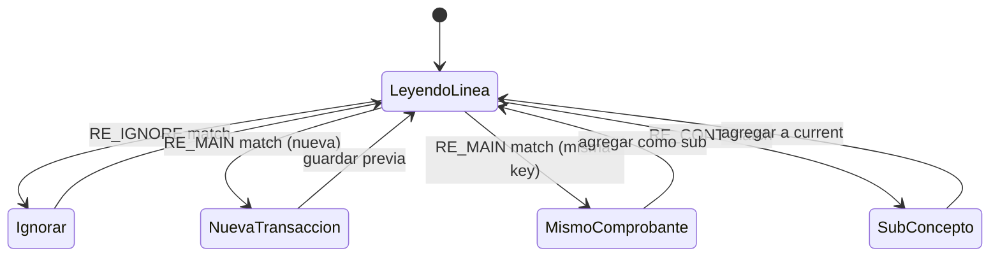
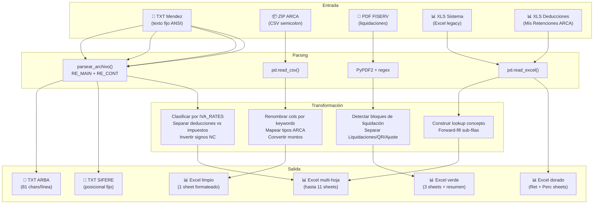

# 📗 Análisis Técnico Completo: `movimientos-a-excel`

## Índice

1. [Visión General](#visión-general)
2. [Arquitectura del Proyecto](#arquitectura-del-proyecto)
3. [Dependencias y Stack Tecnológico](#dependencias-y-stack-tecnológico)
4. [Módulo Core: `extractor_movimientos.py`](#módulo-core-extractor_movimientospy)
   - [Diccionario CONCEPTOS_MAP](#diccionario-conceptos_map)
   - [Motor de Parsing Regex](#motor-de-parsing-regex)
   - [Función `parsear_archivo()`](#función-parsear_archivo)
   - [Función `crear_excel()`](#función-crear_excel)
   - [Generadores de archivos regulatorios](#generadores-de-archivos-regulatorios)
5. [Interfaz Web: `app.py`](#interfaz-web-apppy)
   - [Sistema de diseño CSS](#sistema-de-diseño-css)
   - [Las 8 herramientas](#las-8-herramientas)
6. [Flujo de Datos Completo](#flujo-de-datos-completo)
7. [Diagramas de Arquitectura](#diagramas-de-arquitectura)
8. [Archivos Auxiliares](#archivos-auxiliares)

---

## Visión General

**`movimientos-a-excel`** es una aplicación ETL (Extract-Transform-Load) especializada en contabilidad fiscal argentina. Transforma archivos de texto plano generados por el sistema contable **"Mendez" (ADDISYC/Clasificador Rural)** en archivos Excel profesionalmente formateados, y además genera archivos regulatorios para ARCA (ex-AFIP), SIFERE y ARBA.

### ¿Qué problema resuelve?

El sistema contable Mendez genera reportes en archivos `.txt`/`.prn` con formato de texto fijo (columnas alineadas por espacios). Estos archivos son difíciles de auditar, cruzar y presentar. Esta herramienta:

1. **Parsea** los TXT con expresiones regulares para extraer cada transacción fiscal
2. **Clasifica** automáticamente cada monto según su tasa de IVA, percepciones y retenciones
3. **Genera** Excel con múltiples hojas de resúmenes, fórmulas interactivas y estilo profesional
4. **Produce** archivos TXT regulatorios con formato posicional fijo (SIFERE, ARBA)
5. **Cruza** comprobantes entre el sistema y ARCA para detectar diferencias

---

## Arquitectura del Proyecto

```
movimientos-a-excel/
├── app.py                         # Interfaz web Streamlit (2853 líneas)
├── extractor_movimientos.py       # Motor de parsing y generación Excel (2414 líneas)
├── _fix_money.py                  # Script one-shot de migración (29 líneas)
├── requirements.txt               # Dependencias Python
├── comando-inicio-entorno.txt     # Notas de activación del venv
├── venv/                          # Entorno virtual Python
└── .gitignore
```



---

## Dependencias y Stack Tecnológico

| Paquete | Versión | Uso |
|---------|---------|-----|
| `streamlit` | 1.28.1 | Interfaz web interactiva |
| `pandas` | 2.1.1 | Manipulación de DataFrames |
| `openpyxl` | 3.1.2 | Generación y estilización de archivos Excel (.xlsx) |
| `PyPDF2` | 3.0.1 | Extracción de texto de PDFs (liquidaciones de tarjeta) |
| `xlrd` | ≥2.0.1 | Lectura de archivos Excel legacy (.xls) |

### Ejecución

```bash
# Activar entorno virtual
.\venv\Scripts\Activate.ps1

# Ejecutar aplicación web
streamlit run app.py

# Ejecutar como script CLI (modo alternativo)
python extractor_movimientos.py archivo.txt
```

---

## Módulo Core: `extractor_movimientos.py`

Este archivo (2414 líneas) es el corazón de toda la aplicación. Contiene el parser de archivos TXT, el generador de Excel y los generadores de archivos regulatorios.

### Diccionario CONCEPTOS_MAP

[extractor_movimientos.py:L12-L78](file:///c:/Users/capan/Desktop/Trabajo/movimientos-a-excel/extractor_movimientos.py#L12-L78)

Un diccionario con **~200 entradas** que mapea códigos numéricos (strings) a descripciones legibles de conceptos contables. Cada transacción en el sistema Mendez tiene un código de concepto (1-204) que identifica la naturaleza de la operación.

**Ejemplo:**
```python
"1": "Mercaderia c/iva"     # Compra de mercadería CON IVA
"80": "venta de mercaderia c/iva"  # Venta CON IVA
"29": "imp. Tasas y contribuciones" # Impuestos
```

Los conceptos se agrupan semánticamente:
- **1-18**: Materias primas y mercaderías
- **19-59**: Gastos generales, bancarios, administrativos, servicios
- **60-78**: Bienes de uso, maquinarias, inmuebles
- **80-107**: Ventas y servicios
- **108+**: Conceptos especiales (comisiones, licencias, ganado, etc.)

---

### Motor de Parsing Regex

El sistema utiliza 4 expresiones regulares principales para interpretar el formato de texto fijo del sistema Mendez:

#### `RE_MAIN` — Línea principal de transacción
[extractor_movimientos.py:L88-L98](file:///c:/Users/capan/Desktop/Trabajo/movimientos-a-excel/extractor_movimientos.py#L88-L98)

```python
RE_MAIN = re.compile(
    r'^\s*(\d{1,2})\s+'                # Dia (1-2 dígitos)
    r'(FC|NC|ND|TF|TK)\s+'             # Tipo comprobante
    r'(\d{5}-\d{1,12}[A-Z ]?)\s*'      # Numero (PV-NNNNN[Letra])
    r'(.+?)\s+'                         # Proveedor (captura no-greedy)
    r'(Ins\.|Mono|Monot|Exe |Exe\.|C\.F\.|Exp\.|Resp\.|SNC)\s+'  # Cond IVA
    r'([\d-]{1,13})?\s+'               # CUIT/DNI (opcional)
    r'(\d{1,3})\s+'                     # Concepto (código numérico)
    r'([A-Z])\s+'                       # Jurisdicción (letra A-Z)
    r'(.+)$'                            # Resto (tasa + montos)
)
```

**Grupos de captura:**
| Grupo | Campo | Ejemplo |
|-------|-------|---------|
| 1 | Día | `15` |
| 2 | Tipo | `FC` (Factura), `NC` (Nota de Crédito), `ND` (Nota de Débito), `TF` (Ticket Factura), `TK` (Ticket) |
| 3 | PV-Número | `05009-07466844A` |
| 4 | Proveedor | `AUTOPISTAS URBANAS S A` |
| 5 | Condición IVA | `Ins.` (Inscripto), `Mono` (Monotributo), `Exe` (Exento), `C.F.` (Consumidor Final) |
| 6 | CUIT | `30-57487647-4` |
| 7 | Concepto | `45` |
| 8 | Jurisdicción | `B` (Buenos Aires) |
| 9 | Resto | `Exento  743,65  0,00  0,00  743,65` |

#### `RE_CONT` — Línea de continuación (sub-conceptos)
[extractor_movimientos.py:L102-L105](file:///c:/Users/capan/Desktop/Trabajo/movimientos-a-excel/extractor_movimientos.py#L102-L105)

```python
RE_CONT = re.compile(
    r'^\s{50,}'      # ≥50 espacios al inicio (línea indentada)
    r'(\S.+)$'       # contenido del sub-concepto
)
```

Las líneas de continuación representan montos adicionales del **mismo comprobante** pero con distinta tasa de IVA, percepciones o retenciones. Ejemplo:
```
                                                                       Imp.Inter        385,94          0,00          0,00       5802,89
                                                                       PERC.IVA         123,45          0,00          0,00       5926,34
```

#### `RE_MONTO` — Extracción de montos
[extractor_movimientos.py:L108](file:///c:/Users/capan/Desktop/Trabajo/movimientos-a-excel/extractor_movimientos.py#L108)

```python
RE_MONTO = re.compile(r'-?[\d]+(?:\.[\d]{3})*,\d{2}')
```

Captura montos en formato argentino: `1.234,56` o `-1.234,56`. Los puntos son separadores de miles, la coma es separador decimal.

#### `RE_IGNORE` — Líneas a ignorar
[extractor_movimientos.py:L111-L137](file:///c:/Users/capan/Desktop/Trabajo/movimientos-a-excel/extractor_movimientos.py#L111-L137)

Un patrón compuesto que filtra:
- Líneas en blanco
- Encabezados de página (`Pag.:`, `CLASIFICADORURAL`, `Dia  Numero`)
- Separadores (`---`, `===`)
- Subtotales de página (`==>`, `TOTALES POR`, `TOTAL GENERAL`)
- Tablas de resumen del TXT (`Cod  Concepto`)
- Caracteres de control (form feed `\x0c`, ESC sequences `\x1b`)

---

### Función `parsear_archivo()`

[extractor_movimientos.py:L197-L331](file:///c:/Users/capan/Desktop/Trabajo/movimientos-a-excel/extractor_movimientos.py#L197-L331)

**Entrada:** Ruta a un archivo `.txt` o contenido como string
**Salida:** `(transacciones: list[dict], meta: dict)`

#### Extracción de Metadata (líneas 1-6 del archivo)

```python
meta = {
    'razon_social': '',      # Línea 2 del archivo
    'cuit_empresa': '',      # Extraído de línea 4 con regex CUIT:XX-XXXXXXXX-X
    'periodo': '',           # Línea 6: "Desde el DD/MM/YYYY hasta el DD/MM/YYYY"
    'tipo_reporte': '',      # Línea 5: "IVA COMPRAS" o "IVA VENTAS"
}
```

#### Máquina de estados del parser



**Detección de salto de página:** Cuando una transacción se parte entre dos páginas del TXT, el parser detecta que la siguiente línea `RE_MAIN` tiene el **mismo Día + Tipo + Número + CUIT + Proveedor** que la transacción actual. En ese caso, en lugar de crear una nueva transacción, agrega los montos como sub-conceptos del comprobante existente.

#### Estructura de una transacción parseada

```python
{
    'Fecha': 15,                     # int: día del mes
    'Tipo': 'FC',                    # str: FC/NC/ND/TF/TK
    'Numero': '05009-07466844A',     # str: PV-Nro+Letra
    'Proveedor': 'AUTOPISTAS URBANAS S A',
    'Cond_IVA': 'Ins.',              # Condición fiscal
    'CUIT': '30-57487647-4',
    'Concepto': 45,                  # int: código concepto
    'Letra': 'B',                    # Jurisdicción fiscal
    'Tasa': 'Tasa 21%',             # Tasa del primer renglón
    'Neto': 743.65,                  # Monto neto
    'IVA': 156.17,                   # Monto IVA
    'Percepcion': 0.0,               # Percepción
    'Total': 899.82,                 # Total del comprobante
    'SubConceptos': [                # Lista de líneas adicionales
        {
            'Concepto': 'PERC.IVA',
            'Neto': 12.34,
            'IVA': 0.0,
            'Percepcion': 0.0,
            'Total': 912.16
        }
    ]
}
```

---

### Función `crear_excel()`

[extractor_movimientos.py:L356-L1791](file:///c:/Users/capan/Desktop/Trabajo/movimientos-a-excel/extractor_movimientos.py#L356-L1791)

Esta es la función más compleja del proyecto (~1400 líneas). Genera un archivo Excel multi-hoja con formato profesional.

**Firma:**
```python
def crear_excel(
    transacciones: list[dict],
    meta: dict,
    output_path,               # Path o BytesIO
    con_resumenes=True,        # Incluir hojas de resumen
    con_auxiliar=False,         # Columna Auxiliar de cruce
    cruce_arca=False,           # Modo cruce con ARCA
    df_arca=None,               # DataFrame de comprobantes ARCA
    con_asiento=False           # Incluir hoja Asiento Contable
)
```

#### Sistema de mapeo de tasas IVA

[extractor_movimientos.py:L362-L403](file:///c:/Users/capan/Desktop/Trabajo/movimientos-a-excel/extractor_movimientos.py#L362-L403)

El diccionario `IVA_RATES` mapea cada tasa del TXT a un par de columnas `(Neto, IVA)`:

```python
IVA_RATES = {
    'Tasa 21%':     ('Neto IVA 21',     'IVA 21'),
    'T.21%':        ('Neto IVA 21',     'IVA 21'),      # Variante abreviada
    'C.F.21%':      ('Neto C.F. 21',    'IVA C.F. 21'), # Consumidor Final
    'Tasa 10.5%':   ('Neto IVA 10.5',   'IVA 10.5'),
    'T.10,5%':      ('Neto IVA 10.5',   'IVA 10.5'),    # Variante con coma
    'Exento':       ('Exento',           None),           # Sin IVA
    'R.Monot21':    ('Neto Monot. 21',   'IVA Monot. 21'), # Solo en ventas
    ...
}
```

> [!IMPORTANT]
> El sistema detecta automáticamente qué columnas de IVA están presentes en los datos y **solo crea columnas para las tasas que realmente existen**. No se crean columnas vacías.

#### Detección de deducciones vs impuestos

[extractor_movimientos.py:L447-L454](file:///c:/Users/capan/Desktop/Trabajo/movimientos-a-excel/extractor_movimientos.py#L447-L454)

Los sub-conceptos que no son tasas IVA conocidas se clasifican en dos categorías:
- **Deducciones** (PERC, RET, SIRCREB, SIRTAC) → columnas con cabecera **verde**
- **Otros impuestos** (IMP.CIG, IMP.SELLO, etc.) → columnas con cabecera **amarilla**

```python
_DEDUCCION_KW = ("PERC", "PER.", "PER ", "RET", "SIRCREB", "SIRTAC")
def _es_deduccion(nombre: str) -> bool:
    nu = nombre.upper()
    return any(kw in nu for kw in _DEDUCCION_KW)
```

#### Inversión de signo para Notas de Crédito

[extractor_movimientos.py:L521-L525](file:///c:/Users/capan/Desktop/Trabajo/movimientos-a-excel/extractor_movimientos.py#L521-L525)

```python
if t['Tipo'] == 'NC':
    for col in IVA_COL_ORDER + other_cols:
        row[col] = -row[col]
    row['Total'] = -row['Total']
```

Las NC siempre invierten el signo de todos sus montos para que al sumar los totales se resten correctamente.

#### Las hojas del Excel generado

```mermaid
graph LR
    subgraph "Excel Output"
        M["📊 Movimientos<br/>(o SISTEMA)"]
        RI["📊 Resumen x Impuesto"]
        RT["📊 Resumen x Comprobante"]
        RC["📊 Resumen x Concepto"]
        RJ["📊 Resumen x Concepto y Jur."]
        RP["📊 Resumen x Proveedor"]
        MA["📊 Mayor x Proveedor"]
        AS["📊 Asiento Contable"]
        AR["📊 ARCA"]
        DM["📊 DE MAS EN SISTEMA"]
        FA["📊 FALTANTES ARCA"]
    end

    style M fill:#4472C4,color:#fff
    style RI fill:#BF8F00,color:#fff
    style AS fill:#375623,color:#fff
    style AR fill:#7030A0,color:#fff
    style DM fill:#C00000,color:#fff
    style FA fill:#C00000,color:#fff
```



##### 1. Hoja **Movimientos** (o **SISTEMA** en modo cruce ARCA)

Cada fila = un comprobante. Columnas fijas + columnas dinámicas de IVA/impuestos/deducciones.

**Estructura de columnas:**

| Columnas fijas | Columnas dinámicas IVA (amarillo) | Columnas dinámicas deducciones (verde) | Columna final |
|---|---|---|---|
| Fecha, Tipo, PV, Nro., Letra, Proveedor, Cond. IVA, CUIT, Concepto, Jur. | Neto IVA 21, IVA 21, Neto IVA 10.5, IVA 10.5, Exento... | PERC.IVA, PERC.GCIAS, RET.IB.BS.AS... | Total (=SUM fórmula) |

**Formato:**
- Filas 1-4: Encabezado con razón social, tipo de reporte, CUIT/periodo, total de transacciones
- Fila 5: Vacía (separador)
- Fila 6: Headers de columna (azul para fijos, amarillo para IVA, verde para deducciones)
- Fila 7+: Datos con patrón zebra (azul claro cada 2 filas)
- Última fila: TOTAL GENERAL con fórmulas `=SUM()`

> [!NOTE]
> La columna **Total** de cada fila no contiene el valor del TXT sino una **fórmula `=SUM()`** que suma todas las columnas dinámicas. Esto permite que el usuario verifique que el total calculado coincida con el esperado.

##### 2. Hoja **Resumen x Impuesto** (interactiva)

Cada fila = una tasa de IVA o deducción. Usa **fórmulas que referencian la hoja Movimientos** (`=Movimientos!$X$TOTAL`), lo que las hace interactivas: si el usuario modifica un monto en Movimientos, los resúmenes se actualizan automáticamente.

| Tasa | Neto | IVA | Deducciones | Total |
|------|------|-----|-------------|-------|
| Tasa 21% | =Movimientos!K$total | =Movimientos!L$total | 0 | =B7+C7+D7 |
| Exento | =Movimientos!M$total | 0 | 0 | =B8+C8+D8 |
| PERC.IVA | 0 | 0 | =Movimientos!P$total | =B9+C9+D9 |

El orden de filas se define por dos diccionarios:
- `TASA_ORDER_MAP`: ~58 entradas para impuestos (Exento→1, Tasa 21%→2, etc.)
- `DEDUCCION_ORDER_MAP`: ~26 entradas para deducciones (PERC.I.V.A.→1, PERC.GCIAS.→2, etc.)

##### 3. Hoja **Resumen x Comprobante**

Agrupado por Tipo (FC, NC, ND, TF, TK). Cada celda usa `SUMIFS()` para sumar solo las transacciones del tipo correspondiente.

##### 4. Hoja **Resumen x Concepto**

Agrupado por código de concepto (1, 2, 3...). Incluye columna "Descripcion" con el nombre del `CONCEPTOS_MAP`. Las fórmulas usan `SUMIFS()` con criterio en el concepto.

##### 5. Hoja **Resumen x Concepto y Jur.** (Pivot para CM05)

Es una **tabla pivotada**: filas = conceptos, columnas = jurisdicciones (letras A-Z con nombre de provincia). Cada celda suma solo los **netos** (base imponible) del concepto+jurisdicción correspondiente.

Las jurisdicciones se etiquetan usando `JUR_NOMBRES` (ej: `B - Buenos Aires`, `X - Córdoba`).

##### 6. Hoja **Resumen x Proveedor**

Agrupado por CUIT. Usa `SUMIFS()` para sumar los montos de cada proveedor.

##### 7. Hoja **Mayor x Proveedor**

Un libro mayor auxiliar: las transacciones se ordenan por CUIT y luego por fecha. Incluye una columna **Saldo Acumulado** con fórmula condicional:
```excel
=IF(A8=A7, H7+G8, G8)
```
Esto reinicia el saldo cuando cambia el proveedor.

##### 8. Hoja **Asiento Contable**

[extractor_movimientos.py:L1456-L1578](file:///c:/Users/capan/Desktop/Trabajo/movimientos-a-excel/extractor_movimientos.py#L1456-L1578)

Genera un pre-asiento contable con 3 columnas (DESCRIPCIÓN, DEBE, HABER):

1. **DEBE**: Una fila por cada concepto con su neto total, luego IVA total, luego cada deducción individualmente
2. **HABER**: 
   - `a PROVEEDORES` = SUM(DEBE) - DEUDORES
   - `a DEUDORES POR VENTAS` = Suma de retenciones fiscales (RET.* excluyendo SIRCREB y Bancarias)

##### 9-11. Hojas de cruce ARCA

Cuando se activa `cruce_arca=True`:
- **SISTEMA**: Misma hoja de movimientos pero con columna **CRUCE** (VLOOKUP) y **DIFF** (Total - CRUCE)
- **ARCA**: Los comprobantes del CSV de ARCA con las mismas columnas CRUCE/DIFF en dirección inversa
- **DE MAS EN SISTEMA**: Comprobantes en SISTEMA no encontrados en ARCA (fondo rojo)
- **FALTANTES ARCA**: Comprobantes en ARCA no encontrados en SISTEMA (fondo rojo)

La clave de cruce es la columna **Auxiliar**: `Tipo + " " + Letra + PV + Nro + CUIT`

---

### Generadores de archivos regulatorios

#### `generar_sifere_txt()` — Percepciones IIBB

[extractor_movimientos.py:L1794-L1975](file:///c:/Users/capan/Desktop/Trabajo/movimientos-a-excel/extractor_movimientos.py#L1794-L1975)

Genera un archivo TXT con **formato posicional fijo** para cargar percepciones de Ingresos Brutos en el sistema SIFERE (Sistema Federal de Recaudación del Convenio Multilateral).

**Formato de cada línea:**
```
CodJur(3) + CUIT(13) + Fecha(10) + PV(4) + Nro(8) + TipoComp(2) + Monto(11)
```

**Ejemplo:**
```
90230-57487647-415/03/2026000507466844FA00000743,65
```

El mapeo `CODIGOS_JURISDICCION` tiene 24 entradas mapeando nombres de percepciones a códigos (901=CABA, 902=Bs.As., etc.)

**Filtros:**
- Solo extrae percepciones IIBB (keyword `PERC` en el nombre)
- Excluye aduaneras, IVA y ganancias
- Montos con signo negativo para NC (formato: `-0000743,65`)

#### `generar_sifere_retenciones_txt()` — Retenciones IIBB

[extractor_movimientos.py:L1978-L2176](file:///c:/Users/capan/Desktop/Trabajo/movimientos-a-excel/extractor_movimientos.py#L1978-L2176)

Similar a percepciones pero con **Formato Nº 1** de SIFERE para retenciones: 79 caracteres por línea.

**Formato:**
```
CodJur(3) + CUIT(13) + Fecha(10) + Sucursal(4) + NroConstancia(16) + TipoComp(1) + LetraComp(1) + NroCompOriginal(20) + Importe(11)
```

Usa `PROVINCIA_A_JURISDICCION` para mapear nombres de retenciones a códigos de jurisdicción mediante búsqueda de keywords de provincia en el nombre.

#### `generar_percepciones_arba_txt()` — Percepciones ARBA

[extractor_movimientos.py:L2179-L2358](file:///c:/Users/capan/Desktop/Trabajo/movimientos-a-excel/extractor_movimientos.py#L2179-L2358)

Genera archivo TXT para **ARBA** (Agencia de Recaudación de Buenos Aires). Solo extrae percepciones IIBB de Buenos Aires.

**Formato: 81 caracteres por línea:**
```
CUIT(13) + Fecha(10) + TipoComp(1) + Letra(1) + PV(5) + NroComp(8) + BaseImponible(14) + Alicuota(5) + ImportePerc(13) + Fecha(10) + LetraFija(1)
```

**Cálculolculos especiales:**
- **Base Imponible** = Suma de todos los Netos de tasas IVA del comprobante
- **Alícuota** = Percepción / Base × 100
- Para NC: los montos llevan signo negativo (un dígito menos de relleno)

---

## Interfaz Web: `app.py`

### Sistema de diseño CSS

[app.py:L20-L358](file:///c:/Users/capan/Desktop/Trabajo/movimientos-a-excel/app.py#L20-L358)

La aplicación tiene un tema oscuro personalizado ("dark mode premium") con variables CSS:

| Variable | Valor | Uso |
|----------|-------|-----|
| `--bg` | `#0d0f14` | Fondo principal |
| `--surface` | `#141720` | Fondo de cards |
| `--border` | `#252935` | Bordes |
| `--accent` | `#e8c84a` | Color primario (dorado/ámbar) |
| `--accent2` | `#4ae8a0` | Color secundario (verde) |
| `--muted` | `#6b7280` | Texto secundario |
| `--danger` | `#f87171` | Errores |

**Tipografías:**
- **Syne** (800 weight) para títulos
- **Space Mono** para labels y datos técnicos

**Componentes estilizados:**
- Cards con borde superior gradiente dorado
- File uploader con borde punteado reactivo al hover
- Botón de acción dorado con efecto glow
- Botón de descarga con borde verde
- Stats chips (contadores) en fondo oscuro
- Alerts personalizados con opacidad por tipo
- Selectbox con dropdown oscuro
- Scrollbar minimalista

---

### Las 8 herramientas

#### 1. Listado por fecha TXT Mendez a Excel limpio

[app.py:L416-L693](file:///c:/Users/capan/Desktop/Trabajo/movimientos-a-excel/app.py#L416-L693)

**La herramienta principal.** Flujo:
1. Sube archivo `.txt` o `.prn`
2. Elige modo: Solo Movimientos / Con Auxiliar / Con Resúmenes / Cruce ARCA / Asiento Contable
3. Si es cruce ARCA: sube `.zip` de ARCA
4. Parsea → genera Excel → descarga

**Modos de exportación:**
- **Solo Movimientos**: Solo la hoja principal con una fila por comprobante
- **Con Auxiliar**: Agrega columna con fórmula de concatenación para cruce manual
- **Con Resúmenes**: Agrega 6 hojas de resúmenes con fórmulas interactivas
- **Cruce ARCA**: Genera hojas SISTEMA/ARCA con VLOOKUP + diferencias
- **Asiento Contable**: Agrega hoja de pre-asiento contable

#### 2. Movimientos Portal IVA limpio (.zip)

[app.py:L710-L1034](file:///c:/Users/capan/Desktop/Trabajo/movimientos-a-excel/app.py#L710-L1034)

Procesa los CSV exportados del **Portal IVA de ARCA** (comprimidos en .zip). A diferencia de la herramienta 1, no usa el parser de TXT Mendez sino que lee CSV directamente.

**Proceso:**
1. Extrae el CSV del ZIP (encoding latin-1)
2. Detecta separador (`;` o `,`)
3. Mapea ~40 tipos de comprobante ARCA a tipos internos (FC, NC, ND, TF, TK)
4. Renombra columnas con un sistema de keywords: busca coincidencia parcial case-insensitive
5. Convierte montos de formato argentino (`1.234,56`) a float
6. Elimina columnas monetarias todo-cero
7. Genera Excel estilizado con fórmula TOTAL

**Detección de tipo (Compras/Ventas):** Se extrae del nombre del ZIP (`VENTA` o `COMPRA` en el nombre)

#### 3. Archivos SIFERE (.txt)

[app.py:L1037-L1120](file:///c:/Users/capan/Desktop/Trabajo/movimientos-a-excel/app.py#L1037-L1120)

Genera archivos TXT con formato SIFERE. Ofrece elegir entre **Percepciones** o **Retenciones**. Usa `parsear_archivo()` + `generar_sifere_txt()` o `generar_sifere_retenciones_txt()`.

#### 4. Archivo Agente de Percepciones ARBA (.txt)

[app.py:L1942-L2043](file:///c:/Users/capan/Desktop/Trabajo/movimientos-a-excel/app.py#L1942-L2043)

Genera el archivo TXT para declarar percepciones IIBB ante ARBA. Requiere que el usuario ingrese el periodo (MM/AAAA). El nombre del archivo generado sigue la convención ARBA: `AR-CUIT-YYYYMM-P7-1.txt`.

#### 5. Liquidaciones Tarjeta FISERV (.pdf)

[app.py:L1123-L1681](file:///c:/Users/capan/Desktop/Trabajo/movimientos-a-excel/app.py#L1123-L1681)

**La herramienta más autónoma**, no usa `extractor_movimientos.py`. Parsea liquidaciones de tarjeta de crédito/débito en formato PDF de FISERV/First Data.

**Parser de PDF:**
1. Extrae texto con PyPDF2
2. Detecta bloques de liquidación con keywords (`VENTAS`, `QR`, `AJUSTE`)
3. Extrae montos después del símbolo `$` (split por `$`)
4. Agrupa por liquidación usando la línea `F.de Pago`
5. Separa en 3 DataFrames: Liquidaciones, QR, Ajustes

**Excel generado:**
- Tema **verde** (diferente al tema azul del resto)
- Encabezado con tipo de tarjeta, contribuyente, comprobante y periodo
- 3 hojas: Liquidaciones, QR, AJUSTE
- **Resumen Impositivo** automático: calcula IVA 21%, IVA 10.5%, PERC IVA, SIRTAC, PERC IIBB con fórmulas inversas (Neto = IVA / 0.21)
- Highlight amarillo/naranja para CARGO TERMINAL y ACREDITACIONES PAGO QRD

#### 6. Limpieza Excel Deducciones IVA/Ganancias

[app.py:L1684-L1939](file:///c:/Users/capan/Desktop/Trabajo/movimientos-a-excel/app.py#L1684-L1939)

Limpia y estiliza archivos Excel descargados de **Mis Retenciones/Percepciones** de ARCA.

**Proceso:**
1. Lee el XLS de ARCA
2. Detecta tipo (IVA, Ganancias o SIRE)
3. Elimina columnas redundantes (Impuesto, Régimen numérico)
4. Renombra columnas con nombres más cortos
5. Formatea CUIT como XX-XXXXXXXX-X
6. Ordena por fecha ascendente
7. Separa en hojas **Retenciones** y **Percepciones**
8. Aplica estilo **dorado/ámbar** (diferente al azul y verde de otras herramientas)

#### 7. Excel Mendez + TXT Mendez (Cruce Concepto)

[app.py:L2046-L2412](file:///c:/Users/capan/Desktop/Trabajo/movimientos-a-excel/app.py#L2046-L2412)

Cruza dos fuentes del mismo sistema:
- **TXT de movimientos** (tiene Concepto y Jurisdicción)
- **Excel del sistema** (tiene montos desglosados por tasa pero NO tiene Concepto ni Jurisdicción)

**Algoritmo de cruce:**

```python
key = f"{Tipo}|{PV}|{Nro}|{CUIT}"
```

1. Parsea el TXT → construye diccionario `concepto_lookup[key] = (concepto, jurisdicción)`
2. Lee el Excel → para cada fila cabecera (tiene Fecha), construye la key y busca en el lookup
3. Inserta columnas Concepto y Jurisdicción en el Excel
4. Forward-fill para las sub-filas del mismo comprobante

**Dos formatos de salida:**
- **Sistema**: Mantiene estructura original del Excel (múltiples filas por comprobante)
- **Consolidado**: Usa `crear_excel()` = una fila por comprobante con columnas por tasa

#### 8. Papeles de Trabajo CM05

[app.py:L2414-L2851](file:///c:/Users/capan/Desktop/Trabajo/movimientos-a-excel/app.py#L2414-L2851)

Herramienta para preparar los **Papeles de Trabajo del formulario CM05** (Convenio Multilateral). Combina las herramientas 7 (cruce) y 1 (generación Excel) con post-procesamiento.

**Proceso:**
1. Parsea TXT y cruza con Excel del sistema (igual que herramienta 7)
2. Genera Excel con `crear_excel(con_resumenes=True)`
3. **Post-procesa** con openpyxl:
   - Mantiene solo 3 hojas: Movimientos, Resumen x Concepto, Resumen x Concepto y Jur.
   - En "Resumen x Concepto": consolida todas las columnas Neto/Exento/Monotributo → **columna "Neto"**; consolida todas las columnas IVA → **columna "IVA"**; elimina columna "Cantidad"
   - Reescribe fórmulas de Total y Total General tras el borrado de columnas

> [!WARNING]
> El post-procesamiento manipula la hoja directamente con openpyxl después de que `crear_excel()` la escribió. Al borrar columnas con `delete_cols()`, las celdas combinadas (merges) se rompen y hay que rehacerlas manualmente. También las fórmulas que referenciaban columnas borradas deben recalcularse.

---

## Flujo de Datos Completo



---

## Archivos Auxiliares

### `_fix_money.py`

[_fix_money.py](file:///c:/Users/capan/Desktop/Trabajo/movimientos-a-excel/_fix_money.py)

Script de migración **one-shot** (ya ejecutado). Modifica `app.py` para agregar lógica de limpieza de columnas monetarias de ARCA: convertir a numérico, rellenar NaN con 0, eliminar columnas todo-cero. Busca un marcador en el código y lo reemplaza con el nuevo código.

### `comando-inicio-entorno.txt`

Notas del desarrollador con los comandos para activar el entorno virtual en PowerShell:
```powershell
Set-ExecutionPolicy -ExecutionPolicy RemoteSigned -Scope Process
.\venv\Scripts\Activate.ps1
```

### `.gitignore`

Excluye el directorio `venv/` y archivos de caché Python del control de versiones.

---

## Resumen de Métricas del Proyecto

| Métrica | Valor |
|---------|-------|
| Líneas totales de código | **5,267** (app.py: 2,853 + extractor: 2,414) |
| Herramientas de la UI | **8** |
| Hojas Excel posibles | **11** (Movimientos + 6 resúmenes + Asiento + ARCA + overflow ×2) |
| Conceptos contables mapeados | **~200** |
| Tasas IVA soportadas | **~22** variantes (incluyendo abreviaciones) |
| Deducciones mapeadas | **~26** percepciones/retenciones |
| Jurisdicciones fiscales | **25** provincias + Exterior |
| Tipos de comprobante | **5** (FC, NC, ND, TF, TK) |
| Formatos regulatorios generados | **3** (SIFERE percepciones, SIFERE retenciones, ARBA) |
