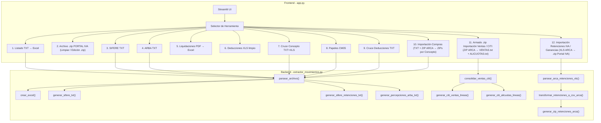
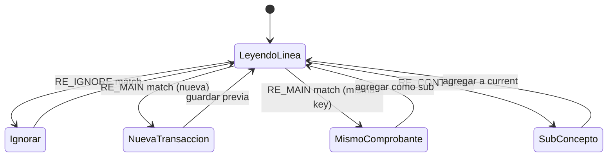
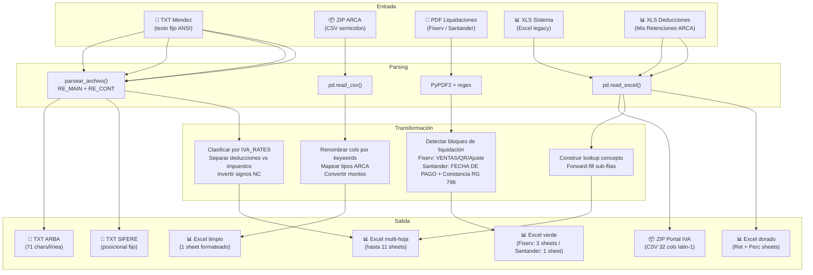

# 📗 Análisis Técnico Completo: `movimientos-a-excel`

## Índice

1. [Visión General](#visión-general)
2. [Arquitectura del Proyecto](#arquitectura-del-proyecto)
3. [Dependencias y Stack Tecnológico](#dependencias-y-stack-tecnológico)
4. [Módulo Core: `extractor_movimientos.py`](#módulo-core-extractor_movimientospy)
   - [Diccionario CONCEPTOS_MAP](#diccionario-conceptos_map)
   - [Motor de Parsing Regex](#motor-de-parsing-regex)
   - [Función `parsear_archivo()`](#función-parsear_archivo)
   - [Función `crear_excel()`](#función-crear_excel)
   - [Generadores de archivos regulatorios](#generadores-de-archivos-regulatorios)
5. [Interfaz Web: `app.py`](#interfaz-web-apppy)
   - [Sistema de diseño CSS](#sistema-de-diseño-css)
   - [Las 12 herramientas](#las-12-herramientas)
6. [Flujo de Datos Completo](#flujo-de-datos-completo)
7. [Diagramas de Arquitectura](#diagramas-de-arquitectura)
8. [Archivos Auxiliares](#archivos-auxiliares)

---

## Visión General

**`movimientos-a-excel`** es una aplicación ETL (Extract-Transform-Load) especializada en contabilidad fiscal argentina. Transforma archivos de texto plano generados por el sistema contable **"Mendez" (ADDISYC/Clasificador Rural)** en archivos Excel profesionalmente formateados, y además genera archivos regulatorios para ARCA (ex-AFIP), SIFERE y ARBA.

### ¿Qué problema resuelve?

El sistema contable Mendez genera reportes en archivos `.txt`/`.prn` con formato de texto fijo (columnas alineadas por espacios). Estos archivos son difíciles de auditar, cruzar y presentar. Esta herramienta:

1. **Parsea** los TXT con expresiones regulares para extraer cada transacción fiscal
2. **Clasifica** automáticamente cada monto según su tasa de IVA, percepciones y retenciones
3. **Genera** Excel con múltiples hojas de resúmenes, fórmulas interactivas y estilo profesional
4. **Produce** archivos TXT regulatorios con formato posicional fijo (SIFERE, ARBA)
5. **Cruza** comprobantes entre el sistema y ARCA para detectar diferencias

---

## Arquitectura del Proyecto

```
movimientos-a-excel/
├── app.py                         # Interfaz web Streamlit (~4550 líneas)
├── extractor_movimientos.py       # Motor de parsing y generación Excel (~2740 líneas)
├── requirements.txt               # Dependencias Python
├── comando-inicio-entorno.txt     # Notas de activación del venv
├── venv/                          # Entorno virtual Python
└── .gitignore
```



---

## Dependencias y Stack Tecnológico

| Paquete | Versión | Uso |
|---------|---------|-----|
| `streamlit` | 1.28.1 | Interfaz web interactiva |
| `pandas` | 2.1.1 | Manipulación de DataFrames |
| `openpyxl` | 3.1.2 | Generación y estilización de archivos Excel (.xlsx) |
| `PyPDF2` | 3.0.1 | Extracción de texto de PDFs (liquidaciones de tarjeta) |
| `xlrd` | ≥2.0.1 | Lectura de archivos Excel legacy (.xls) |

### Ejecución

```bash
# Activar entorno virtual
.\venv\Scripts\Activate.ps1

# Ejecutar aplicación web
streamlit run app.py

# Ejecutar como script CLI (modo alternativo)
python extractor_movimientos.py archivo.txt
```

---

## Módulo Core: `extractor_movimientos.py`

Este archivo (~2,740 líneas) es el corazón de toda la aplicación. Contiene el parser de archivos TXT, el generador de Excel y los generadores de archivos regulatorios.

### Diccionario CONCEPTOS_MAP

[extractor_movimientos.py:L12-L78](file:///c:/Users/capan/Desktop/Trabajo/movimientos-a-excel/extractor_movimientos.py#L12-L78)

Un diccionario con **~200 entradas** que mapea códigos numéricos (strings) a descripciones legibles de conceptos contables. Cada transacción en el sistema Mendez tiene un código de concepto (1-204) que identifica la naturaleza de la operación.

**Ejemplo:**
```python
"1": "Mercaderia c/iva"     # Compra de mercadería CON IVA
"80": "venta de mercaderia c/iva"  # Venta CON IVA
"29": "imp. Tasas y contribuciones" # Impuestos
```

Los conceptos se agrupan semánticamente:
- **1-18**: Materias primas y mercaderías
- **19-59**: Gastos generales, bancarios, administrativos, servicios
- **60-78**: Bienes de uso, maquinarias, inmuebles
- **80-107**: Ventas y servicios
- **108+**: Conceptos especiales (comisiones, licencias, ganado, etc.)

---

### Motor de Parsing Regex

El sistema utiliza 4 expresiones regulares principales para interpretar el formato de texto fijo del sistema Mendez:

#### `RE_MAIN` — Línea principal de transacción
[extractor_movimientos.py:L88-L98](file:///c:/Users/capan/Desktop/Trabajo/movimientos-a-excel/extractor_movimientos.py#L88-L98)

```python
RE_MAIN = re.compile(
    r'^\s*(\d{1,2})\s+'                # Dia (1-2 dígitos)
    r'(FC|NC|ND|TF|TK)\s+'             # Tipo comprobante
    r'(\d{5}-\d{1,12}[A-Z ]?)\s*'      # Numero (PV-NNNNN[Letra])
    r'(.+?)\s+'                         # Proveedor (captura no-greedy)
    r'(Ins\.|Mono|Monot|Exe |Exe\.|C\.F\.|Exp\.|Resp\.|SNC)\s+'  # Cond IVA
    r'([\d-]{1,13})?\s+'               # CUIT/DNI (opcional)
    r'(\d{1,3})\s+'                     # Concepto (código numérico)
    r'([A-Z])\s+'                       # Jurisdicción (letra A-Z)
    r'(.+)$'                            # Resto (tasa + montos)
)
```

**Grupos de captura:**
| Grupo | Campo | Ejemplo |
|-------|-------|---------|
| 1 | Día | `15` |
| 2 | Tipo | `FC` (Factura), `NC` (Nota de Crédito), `ND` (Nota de Débito), `TF` (Ticket Factura), `TK` (Ticket) |
| 3 | PV-Número | `05009-07466844A` |
| 4 | Proveedor | `AUTOPISTAS URBANAS S A` |
| 5 | Condición IVA | `Ins.` (Inscripto), `Mono` (Monotributo), `Exe` (Exento), `C.F.` (Consumidor Final) |
| 6 | CUIT | `30-57487647-4` |
| 7 | Concepto | `45` |
| 8 | Jurisdicción | `B` (Buenos Aires) |
| 9 | Resto | `Exento  743,65  0,00  0,00  743,65` |

#### `RE_CONT` — Línea de continuación (sub-conceptos)
[extractor_movimientos.py:L102-L105](file:///c:/Users/capan/Desktop/Trabajo/movimientos-a-excel/extractor_movimientos.py#L102-L105)

```python
RE_CONT = re.compile(
    r'^\s{50,}'      # ≥50 espacios al inicio (línea indentada)
    r'(\S.+)$'       # contenido del sub-concepto
)
```

Las líneas de continuación representan montos adicionales del **mismo comprobante** pero con distinta tasa de IVA, percepciones o retenciones. Ejemplo:
```
                                                                       Imp.Inter        385,94          0,00          0,00       5802,89
                                                                       PERC.IVA         123,45          0,00          0,00       5926,34
```

#### `RE_MONTO` — Extracción de montos
[extractor_movimientos.py:L108](file:///c:/Users/capan/Desktop/Trabajo/movimientos-a-excel/extractor_movimientos.py#L108)

```python
RE_MONTO = re.compile(r'-?[\d]+(?:\.[\d]{3})*,\d{2}')
```

Captura montos en formato argentino: `1.234,56` o `-1.234,56`. Los puntos son separadores de miles, la coma es separador decimal.

#### `RE_IGNORE` — Líneas a ignorar
[extractor_movimientos.py:L111-L137](file:///c:/Users/capan/Desktop/Trabajo/movimientos-a-excel/extractor_movimientos.py#L111-L137)

Un patrón compuesto que filtra:
- Líneas en blanco
- Encabezados de página (`Pag.:`, `CLASIFICADORURAL`, `Dia  Numero`)
- Separadores (`---`, `===`)
- Subtotales de página (`==>`, `TOTALES POR`, `TOTAL GENERAL`)
- Tablas de resumen del TXT (`Cod  Concepto`)
- Caracteres de control (form feed `\x0c`, ESC sequences `\x1b`)

---

### Función `parsear_archivo()`

[extractor_movimientos.py:L197-L331](file:///c:/Users/capan/Desktop/Trabajo/movimientos-a-excel/extractor_movimientos.py#L197-L331)

**Entrada:** Ruta a un archivo `.txt` o contenido como string
**Salida:** `(transacciones: list[dict], meta: dict)`

#### Extracción de Metadata (líneas 1-6 del archivo)

```python
meta = {
    'razon_social': '',      # Línea 2 del archivo
    'cuit_empresa': '',      # Extraído de línea 4 con regex CUIT:XX-XXXXXXXX-X
    'periodo': '',           # Línea 6: "Desde el DD/MM/YYYY hasta el DD/MM/YYYY"
    'tipo_reporte': '',      # Línea 5: "IVA COMPRAS" o "IVA VENTAS"
}
```

#### Máquina de estados del parser



**Detección de salto de página:** Cuando una transacción se parte entre dos páginas del TXT, el parser detecta que la siguiente línea `RE_MAIN` tiene el **mismo Día + Tipo + Número + CUIT + Proveedor** que la transacción actual. En ese caso, en lugar de crear una nueva transacción, agrega los montos como sub-conceptos del comprobante existente.

#### Estructura de una transacción parseada

```python
{
    'Fecha': 15,                     # int: día del mes
    'Tipo': 'FC',                    # str: FC/NC/ND/TF/TK
    'Numero': '05009-07466844A',     # str: PV-Nro+Letra
    'Proveedor': 'AUTOPISTAS URBANAS S A',
    'Cond_IVA': 'Ins.',              # Condición fiscal
    'CUIT': '30-57487647-4',
    'Concepto': 45,                  # int: código concepto
    'Letra': 'B',                    # Jurisdicción fiscal
    'Tasa': 'Tasa 21%',             # Tasa del primer renglón
    'Neto': 743.65,                  # Monto neto
    'IVA': 156.17,                   # Monto IVA
    'Percepcion': 0.0,               # Percepción
    'Total': 899.82,                 # Total del comprobante
    'SubConceptos': [                # Lista de líneas adicionales
        {
            'Concepto': 'PERC.IVA',
            'Neto': 12.34,
            'IVA': 0.0,
            'Percepcion': 0.0,
            'Total': 912.16
        }
    ]
}
```

---

### Helper `construir_sistema_aux_set()`

[extractor_movimientos.py:L334-L355](file:///c:/Users/capan/Desktop/Trabajo/movimientos-a-excel/extractor_movimientos.py#L334-L355)

**Entrada:** `transacciones: list[dict]` (la lista devuelta por `parsear_archivo()`).
**Salida:** `set[str]` con las claves Auxiliar del SISTEMA con formato `Tipo + ' ' + Letra + PV + Nro + CUIT` (sin espacios entre los últimos cuatro), iguales a las que `crear_excel()` arma internamente para cruzar contra el Auxiliar de ARCA.

Es un helper de módulo expuesto para que `app.py` pueda calcular el set sin re-correr la generación de Excel. Lo usa la herramienta 1 modo Cruce ARCA al armar el `.zip de Faltantes`: con este set se identifican las filas de ARCA que no tienen contraparte en el SISTEMA y se reempaquetan en un .zip byte-equivalente al original.

---

### Función `crear_excel()`

[extractor_movimientos.py:L356-L1791](file:///c:/Users/capan/Desktop/Trabajo/movimientos-a-excel/extractor_movimientos.py#L356-L1791)

Esta es la función más compleja del proyecto (~1400 líneas). Genera un archivo Excel multi-hoja con formato profesional.

**Firma:**
```python
def crear_excel(
    transacciones: list[dict],
    meta: dict,
    output_path,               # Path o BytesIO
    con_resumenes=True,        # Incluir hojas de resumen
    con_auxiliar=False,         # Columna Auxiliar de cruce
    cruce_arca=False,           # Modo cruce con ARCA
    df_arca=None,               # DataFrame de comprobantes ARCA
    con_asiento=False           # Incluir hoja Asiento Contable
)
```

#### Sistema de mapeo de tasas IVA

[extractor_movimientos.py:L362-L403](file:///c:/Users/capan/Desktop/Trabajo/movimientos-a-excel/extractor_movimientos.py#L362-L403)

El diccionario `IVA_RATES` mapea cada tasa del TXT a un par de columnas `(Neto, IVA)`:

```python
IVA_RATES = {
    'Tasa 21%':     ('Neto IVA 21',     'IVA 21'),
    'T.21%':        ('Neto IVA 21',     'IVA 21'),      # Variante abreviada
    'C.F.21%':      ('Neto C.F. 21',    'IVA C.F. 21'), # Consumidor Final
    'Tasa 10.5%':   ('Neto IVA 10.5',   'IVA 10.5'),
    'T.10,5%':      ('Neto IVA 10.5',   'IVA 10.5'),    # Variante con coma
    'Exento':       ('Exento',           None),           # Sin IVA
    'R.Monot21':    ('Neto Monot. 21',   'IVA Monot. 21'), # Solo en ventas
    ...
}
```

> [!IMPORTANT]
> El sistema detecta automáticamente qué columnas de IVA están presentes en los datos y **solo crea columnas para las tasas que realmente existen**. No se crean columnas vacías.

#### Detección de deducciones vs impuestos

[extractor_movimientos.py:L447-L454](file:///c:/Users/capan/Desktop/Trabajo/movimientos-a-excel/extractor_movimientos.py#L447-L454)

Los sub-conceptos que no son tasas IVA conocidas se clasifican en dos categorías:
- **Deducciones** (PERC, RET, SIRCREB, SIRTAC) → columnas con cabecera **verde**
- **Otros impuestos** (IMP.CIG, IMP.SELLO, etc.) → columnas con cabecera **amarilla**

```python
_DEDUCCION_KW = ("PERC", "PER.", "PER ", "RET", "SIRCREB", "SIRTAC")
def _es_deduccion(nombre: str) -> bool:
    nu = nombre.upper()
    return any(kw in nu for kw in _DEDUCCION_KW)
```

#### Inversión de signo para Notas de Crédito

[extractor_movimientos.py:L521-L525](file:///c:/Users/capan/Desktop/Trabajo/movimientos-a-excel/extractor_movimientos.py#L521-L525)

```python
if t['Tipo'] == 'NC':
    for col in IVA_COL_ORDER + other_cols:
        row[col] = -row[col]
    row['Total'] = -row['Total']
```

Las NC siempre invierten el signo de todos sus montos para que al sumar los totales se resten correctamente.

#### Las hojas del Excel generado

```mermaid
graph LR
    subgraph "Excel Output"
        M["📊 Movimientos<br/>(o SISTEMA)"]
        RI["📊 Resumen x Impuesto"]
        RT["📊 Resumen x Comprobante"]
        RC["📊 Resumen x Concepto"]
        RJ["📊 Resumen x Concepto y Jur."]
        RP["📊 Resumen x Proveedor"]
        MA["📊 Mayor x Proveedor"]
        AS["📊 Asiento Contable"]
        AR["📊 ARCA"]
        DM["📊 DE MAS EN SISTEMA"]
        FA["📊 FALTANTES ARCA"]
    end

    style M fill:#4472C4,color:#fff
    style RI fill:#BF8F00,color:#fff
    style AS fill:#375623,color:#fff
    style AR fill:#7030A0,color:#fff
    style DM fill:#C00000,color:#fff
    style FA fill:#C00000,color:#fff
```



##### 1. Hoja **Movimientos** (o **SISTEMA** en modo cruce ARCA)

Cada fila = un comprobante. Columnas fijas + columnas dinámicas de IVA/impuestos/deducciones.

**Estructura de columnas:**

| Columnas fijas | Columnas dinámicas IVA (amarillo) | Columnas dinámicas deducciones (verde) | Columna final |
|---|---|---|---|
| Fecha, Tipo, PV, Nro., Letra, Proveedor, Cond. IVA, CUIT, Concepto, Jur. | Neto IVA 21, IVA 21, Neto IVA 10.5, IVA 10.5, Exento... | PERC.IVA, PERC.GCIAS, RET.IB.BS.AS... | Total (=SUM fórmula) |

**Formato:**
- Filas 1-4: Encabezado con razón social, tipo de reporte, CUIT/periodo, total de transacciones
- Fila 5: Vacía (separador)
- Fila 6: Headers de columna (azul para fijos, amarillo para IVA, verde para deducciones)
- Fila 7+: Datos con patrón zebra (azul claro cada 2 filas)
- Última fila: TOTAL GENERAL con fórmulas `=SUM()`

> [!NOTE]
> La columna **Total** de cada fila no contiene el valor del TXT sino una **fórmula `=SUM()`** que suma todas las columnas dinámicas. Esto permite que el usuario verifique que el total calculado coincida con el esperado.

##### 2. Hoja **Resumen x Impuesto** (interactiva)

Cada fila = una tasa de IVA o deducción. Usa **fórmulas que referencian la hoja Movimientos** (`=Movimientos!$X$TOTAL`), lo que las hace interactivas: si el usuario modifica un monto en Movimientos, los resúmenes se actualizan automáticamente.

| Tasa | Neto | IVA | Deducciones | Total |
|------|------|-----|-------------|-------|
| Tasa 21% | =Movimientos!K$total | =Movimientos!L$total | 0 | =B7+C7+D7 |
| Exento | =Movimientos!M$total | 0 | 0 | =B8+C8+D8 |
| PERC.IVA | 0 | 0 | =Movimientos!P$total | =B9+C9+D9 |

El orden de filas se define por dos diccionarios:
- `TASA_ORDER_MAP`: ~58 entradas para impuestos (Exento→1, Tasa 21%→2, etc.)
- `DEDUCCION_ORDER_MAP`: ~26 entradas para deducciones (PERC.I.V.A.→1, PERC.GCIAS.→2, etc.)

##### 3. Hoja **Resumen x Comprobante**

Agrupado por Tipo (FC, NC, ND, TF, TK). Cada celda usa `SUMIFS()` para sumar solo las transacciones del tipo correspondiente.

##### 4. Hoja **Resumen x Concepto**

Agrupado por código de concepto (1, 2, 3...). Incluye columna "Descripcion" con el nombre del `CONCEPTOS_MAP`. Las fórmulas usan `SUMIFS()` con criterio en el concepto.

##### 5. Hoja **Resumen x Concepto y Jur.** (Pivot para CM05)

Es una **tabla pivotada**: filas = conceptos, columnas = jurisdicciones (letras A-Z con nombre de provincia). Cada celda suma solo los **netos** (base imponible) del concepto+jurisdicción correspondiente.

Las jurisdicciones se etiquetan usando `JUR_NOMBRES` (ej: `B - Buenos Aires`, `X - Córdoba`).

##### 6. Hoja **Resumen x Proveedor**

Agrupado por CUIT. Usa `SUMIFS()` para sumar los montos de cada proveedor.

##### 7. Hoja **Mayor x Proveedor**

Un libro mayor auxiliar: las transacciones se ordenan por CUIT y luego por fecha. Incluye una columna **Saldo Acumulado** con fórmula condicional:
```excel
=IF(A8=A7, H7+G8, G8)
```
Esto reinicia el saldo cuando cambia el proveedor.

##### 8. Hoja **Asiento Contable**

[extractor_movimientos.py:L1456-L1700](file:///c:/Users/capan/Desktop/Trabajo/movimientos-a-excel/extractor_movimientos.py#L1456-L1700)

Genera un pre-asiento contable con 3 columnas (DESCRIPCIÓN, DEBE, HABER).

La hoja arranca con **3 filas de encabezado mergeadas** (idénticas a las de la hoja Movimientos):

| Fila | Contenido |
|------|-----------|
| 1 | Razón social en mayúsculas (azul oscuro fondo blanco) |
| 2 | `{tipo_reporte} - ASIENTO CONTABLE` (rojo oscuro) |
| 3 | `CUIT: {cuit_empresa} \| Periodo: {periodo}` |

Recién en la fila 5 aparecen los headers `DESCRIPCIÓN / DEBE / HABER`.

**Detección automática de modo** desde `meta['tipo_reporte']`:
- `IVA COMPRAS` → asiento estilo compras (lógica original).
- `IVA VENTAS` → asiento estilo ventas (rama nueva).

> [!NOTE]
> Las NCs invierten signos antes de llegar al asiento ([extractor_movimientos.py:L521-L526](file:///c:/Users/capan/Desktop/Trabajo/movimientos-a-excel/extractor_movimientos.py#L521-L526)), por lo que los netos e IVA agregados que aparecen en el asiento principal ya son **FC − NC**.

###### Modo Compras

1. **DEBE**: Una fila por cada concepto con su neto total, luego IVA total, luego cada deducción individualmente.
2. **HABER**:
   - `a PROVEEDORES` = `SUM(DEBE) − DEUDORES`.
   - `a DEUDORES POR VENTAS` = suma de las filas DEBE que son retenciones fiscales: contienen `RET` en el nombre **y excluyen** SIRCREB, SIRTAC, y nombres que contengan `BCO` o `BANCO`. Las exclusiones cubren regímenes que no van a Deudores (SIRCREB/SIRTAC son retenciones bancarias automatizadas y los regímenes con `BCO`/`BANCO` son retenciones bancarias que tampoco corresponden).

###### Modo Ventas

Estructura invertida — el receivable arriba, las contracuentas abajo:

1. `DEUDORES POR VENTAS` en DEBE (col B) con fórmula `=SUM(C{first}:C{last})` referenciando el rango HABER que viene a continuación.
2. **HABER** (col C):
   - Una fila `A {DESCRIPCION}` por cada concepto con su neto neteado FC−NC. Las descripciones se toman de `CONCEPTOS_MAP` (típicamente conceptos 80-107 de ventas).
   - `A IVA DEBITO` con la suma neta del IVA.
   - Una fila `A {nombre}` por cada percepción IIBB efectuada del período.

Las filas RET no se emiten en modo ventas porque no son típicas de un libro de ventas (las retenciones aparecen en compras).

###### Asiento de Restitución (ambos modos)

Después del asiento principal, **sólo si el período tiene IVA de NCs**, se agrega un segundo asiento que contabiliza la restitución del IVA correspondiente a las Notas de Crédito. El IVA de NCs se calcula como `abs(SUM(IVA))` filtrando filas con `Tipo == 'NC'`.

**Modo Ventas** — `RESTITUCION DE DEBITO`:
- DEBE: `DEBITO FISCAL IVA` = `abs(IVA NCs)`.
- HABER: `A CREDITO FISCAL IVA` con fórmula `=B{restit_row}` para que ambos importes queden acoplados ante ediciones manuales.

**Modo Compras** — `RESTITUCION DE CREDITO`:
- DEBE: `CREDITO FISCAL IVA` = `abs(IVA NCs)`.
- HABER: `A DEBITO FISCAL IVA` con la misma fórmula `=B{restit_row}`.

Si no hay NCs en el período, el bloque de Restitución no se escribe.

##### 9-11. Hojas de cruce ARCA

Cuando se activa `cruce_arca=True`:
- **SISTEMA**: Misma hoja de movimientos pero con columna **CRUCE** (VLOOKUP) y **DIFF** (Total - CRUCE)
- **ARCA**: Los comprobantes del CSV de ARCA con las mismas columnas CRUCE/DIFF en dirección inversa
- **DE MAS EN SISTEMA**: Comprobantes en SISTEMA no encontrados en ARCA (fondo rojo)
- **FALTANTES ARCA**: Comprobantes en ARCA no encontrados en SISTEMA (fondo rojo)

La clave de cruce es la columna **Auxiliar**: `Tipo + " " + Letra + PV + Nro + CUIT`

---

### Generadores de archivos regulatorios

#### `generar_sifere_txt()` — Percepciones IIBB

[extractor_movimientos.py:L1794-L1975](file:///c:/Users/capan/Desktop/Trabajo/movimientos-a-excel/extractor_movimientos.py#L1794-L1975)

Genera un archivo TXT con **formato posicional fijo** para cargar percepciones de Ingresos Brutos en el sistema SIFERE (Sistema Federal de Recaudación del Convenio Multilateral).

**Formato de cada línea:**
```
CodJur(3) + CUIT(13) + Fecha(10) + PV(4) + Nro(8) + TipoComp(2) + Monto(11)
```

**Ejemplo:**
```
90230-57487647-415/03/2026000507466844FA00000743,65
```

El mapeo `CODIGOS_JURISDICCION` tiene 24 entradas mapeando nombres de percepciones a códigos (901=CABA, 902=Bs.As., etc.)

**Filtros:**
- Solo extrae percepciones IIBB (keyword `PERC` en el nombre)
- Excluye aduaneras, IVA y ganancias
- Montos con signo negativo para NC (formato: `-0000743,65`)

#### `generar_sifere_retenciones_txt()` — Retenciones IIBB

[extractor_movimientos.py:L1978-L2176](file:///c:/Users/capan/Desktop/Trabajo/movimientos-a-excel/extractor_movimientos.py#L1978-L2176)

Similar a percepciones pero con **Formato Nº 1** de SIFERE para retenciones: 79 caracteres por línea.

**Formato:**
```
CodJur(3) + CUIT(13) + Fecha(10) + Sucursal(4) + NroConstancia(16) + TipoComp(1) + LetraComp(1) + NroCompOriginal(20) + Importe(11)
```

Usa `PROVINCIA_A_JURISDICCION` para mapear nombres de retenciones a códigos de jurisdicción mediante búsqueda de keywords de provincia en el nombre.

#### `generar_percepciones_arba_txt()` — Percepciones ARBA

[extractor_movimientos.py:L2179-L2358](file:///c:/Users/capan/Desktop/Trabajo/movimientos-a-excel/extractor_movimientos.py#L2179-L2358)

Genera archivo TXT para **ARBA** (Agencia de Recaudación de Buenos Aires). Solo extrae percepciones IIBB de Buenos Aires.

**Formato: 71 caracteres por línea:**
```
CUIT(13) + Fecha(10) + TipoComp(1) + Letra(1) + Sucursal(5) + NroComp(8) + BaseImponible(14) + Alicuota(5) + ImportePerc(13) + LetraFija(1)
```

**Cálculolculos especiales:**
- **Base Imponible** = Suma de todos los Netos de tasas IVA del comprobante
- **Alícuota** = Percepción / Base × 100
- Para NC: los montos llevan signo negativo (un dígito menos de relleno)

---

## Interfaz Web: `app.py`

### Sistema de diseño CSS

[app.py:L20-L358](file:///c:/Users/capan/Desktop/Trabajo/movimientos-a-excel/app.py#L20-L358)

La aplicación tiene un tema oscuro personalizado ("dark mode premium") con variables CSS:

| Variable | Valor | Uso |
|----------|-------|-----|
| `--bg` | `#0d0f14` | Fondo principal |
| `--surface` | `#141720` | Fondo de cards |
| `--border` | `#252935` | Bordes |
| `--accent` | `#e8c84a` | Color primario (dorado/ámbar) |
| `--accent2` | `#4ae8a0` | Color secundario (verde) |
| `--muted` | `#6b7280` | Texto secundario |
| `--danger` | `#f87171` | Errores |

**Tipografías:**
- **Syne** (800 weight) para títulos
- **Space Mono** para labels y datos técnicos

**Componentes estilizados:**
- Cards con borde superior gradiente dorado
- File uploader con borde punteado reactivo al hover
- Botón de acción dorado con efecto glow
- Botón de descarga con borde verde
- Stats chips (contadores) en fondo oscuro
- Alerts personalizados con opacidad por tipo
- Selectbox con dropdown oscuro
- Scrollbar minimalista

---

### Las 12 herramientas

#### 1. Listado por fecha TXT Mendez a Excel limpio

[app.py:L416-L693](file:///c:/Users/capan/Desktop/Trabajo/movimientos-a-excel/app.py#L416-L693)

**La herramienta principal.** Flujo:
1. Sube archivo `.txt` o `.prn`
2. Elige modo: Solo Movimientos / Con Auxiliar / Con Resúmenes / Cruce ARCA / Asiento Contable
3. Si es cruce ARCA: sube `.zip` de ARCA
4. Parsea → genera Excel → descarga

**Modos de exportación:**
- **Solo Movimientos**: Solo la hoja principal con una fila por comprobante
- **Con Auxiliar**: Agrega columna con fórmula de concatenación para cruce manual
- **Con Resúmenes**: Agrega 6 hojas de resúmenes con fórmulas interactivas
- **Cruce ARCA**: Genera hojas SISTEMA/ARCA con VLOOKUP + diferencias **y, además del Excel, ofrece un segundo botón de descarga `↓ Descargar .zip de Faltantes (N comprobantes)`** que reempaqueta sólo las filas de ARCA que no aparecen en SISTEMA en un `.zip` **byte-equivalente** al original (mismo encoding `latin-1`, mismo separator, mismo nombre de CSV interno, mismas columnas crudas) — apto para alimentar la herramienta 10 (Importación Compras) o re-importar al sistema Mendez/Portal IVA sin retoques. Si no hay faltantes, el botón no aparece.
- **Asiento Contable**: Agrega hoja de pre-asiento contable

> [!NOTE]
> **Round-trip del .zip de Faltantes**: al subir el .zip de ARCA, la app parsea el CSV interno **dos veces** desde el mismo `csv_text`: una con la limpieza/renombrado habitual (que alimenta el Excel) y otra "cruda" con `pd.read_csv(..., dtype=str, keep_default_na=False)` para preservar valores como strings sin reformateo. Después del cruce, las filas faltantes se identifican por la columna Auxiliar de la vista renombrada y se mapean por índice a la vista cruda, que se reserializa con el mismo `sep` y `lineterminator='\n'` y se empaqueta con el `csv_basename` original. El helper que arma el set Auxiliar del SISTEMA es `construir_sistema_aux_set(transacciones)` ([extractor_movimientos.py](extractor_movimientos.py)).

#### 2. Archivo .zip PORTAL IVA

Recibe el `.zip` exportado del **Portal IVA de ARCA** y, según el modo elegido, lo limpia a Excel o lo abre para edición masiva en Excel y lo reempaqueta. Tiene **dos modos** seleccionables vía radio button.

##### Modo A — Limpiar

Procesa los CSV exportados del Portal IVA y genera un Excel formateado con los movimientos. No usa el parser de TXT Mendez — lee el CSV directamente.

**Proceso:**
1. Extrae el CSV del ZIP (encoding latin-1)
2. Detecta separador (`;` o `,`)
3. Mapea ~40 tipos de comprobante ARCA a tipos internos (FC, NC, ND, TF, TK)
4. Renombra columnas con un sistema de keywords: busca coincidencia parcial case-insensitive
5. Convierte montos de formato argentino (`1.234,56`) a float
6. Elimina columnas monetarias todo-cero
7. Genera Excel estilizado con fórmula TOTAL

**Detección de tipo (Compras/Ventas):** Se extrae del nombre del ZIP (`VENTA` o `COMPRA` en el nombre).

##### Modo B — Edición .zip (round-trip a Excel)

Permite editar masivamente el CSV de ARCA en Excel real (sort, filter, autofill, Ctrl+Enter, fórmulas, copy/paste de rangos) y devuelve un `.zip` con la misma estructura que el original — apto para volver a usar en cualquier herramienta que consuma el .zip de ARCA.

**Flujo (3 cards):**

1. **Card 03 — Generar Excel para edición:** lee el CSV del ZIP con `pd.read_csv(dtype=str, keep_default_na=False)` para preservar valores como strings sin reformateo numérico, arma un `.xlsx` con dos hojas:
   - `Comprobantes` (visible) con todas las filas y columnas tal cual el CSV original. Header oscuro, `freeze_panes='A2'`, anchos auto-ajustados.
   - `_meta` (oculta, `sheet_state='hidden'`): pares clave-valor con `csv_basename` (nombre del CSV interno), `sep` (separator detectado) y `zip_basename` (nombre del ZIP original) — para reconstruir el `.zip` idéntico al re-uploadear.

   Los bytes del Excel se persisten en `st.session_state['edit_xlsx_bytes']` para que el botón de descarga sobreviva re-runs.

2. **Card 04 — Subir Excel editado:** `st.file_uploader` con `type=["xlsx"]`.

3. **Card 05 — Generar .zip modificado:**
   - Lee la hoja `_meta` para recuperar `sep`, `csv_basename`, `zip_basename`. Si no existe → error claro ("subí el archivo generado por esta misma herramienta").
   - Lee la hoja `Comprobantes` con `dtype=str, keep_default_na=False`.
   - Serializa a CSV con `df.to_csv(sep=sep, lineterminator='\n')`, encode a `latin-1`.
   - Empaqueta en `{zip_basename}_EDITADO.zip` con el CSV interno bajo el nombre original.

> [!IMPORTANT]
> El modo Edición es **agnóstico al contenido**: no clasifica, no agrupa, no analiza — sólo round-trip de bytes. La salida es un `.zip` byte-equivalente al input excepto por las modificaciones que el usuario haya hecho al CSV interno.

> [!WARNING]
> Si el usuario hace "Guardar como CSV" en Excel, copia las hojas a otro libro, o elimina la hoja `_meta`, la app no puede reconstruir el ZIP y muestra error explícito.

#### 3. Archivos SIFERE (.txt)

[app.py:L1037-L1120](file:///c:/Users/capan/Desktop/Trabajo/movimientos-a-excel/app.py#L1037-L1120)

Genera archivos TXT con formato SIFERE. Ofrece elegir entre **Percepciones** o **Retenciones**. Usa `parsear_archivo()` + `generar_sifere_txt()` o `generar_sifere_retenciones_txt()`.

#### 4. Agentes de Recaudación ARBA

[app.py:L1975-L2150](file:///c:/Users/capan/Desktop/Trabajo/movimientos-a-excel/app.py#L1975-L2150)

Herramienta bifuncional para la generación de archivos para la Agencia de Recaudación de la Provincia de Buenos Aires (ARBA). El comportamiento se adapta según el régimen seleccionado:

**A. Percepciones**
- **Soporta:** TXT nativo (Mendez) o Excel aportado por el cliente.
- **Formato Output:** Líneas posicionales de 71 caracteres.
- **Empaquetado:** El sistema adosa automáticamente el código Hash MD5 al nombre del `.ZIP` emitido (ej. `AR-CUIT-AAAAMMQ-P7-LOTE1_{MD5}.ZIP`). El indicador del diseño varía automáticamente a `D7` si se establece como periodo mensual (0).

**B. Retenciones (Diseño A-122R)**
- **Soporta:** Exclusivamente origen por **Excel** (bloqueo inteligente de formato `.txt`). 
- **Formato Output:** Líneas posicionales exactas de 67 caracteres (Registro ALTA).
- **Control Ulterior:** Se requiere configuración explícita de `Quincena`, `Cod. Actividad` y `Nro Lote`.
- **Empaquetado:** Archivo puro sin hash, acatando el estándar prefijado: `ER-CUIT-AAAAMMQ-ACTIVIDAD-LOTEXXXXX.ZIP`.

#### 5. Liquidaciones Tarjeta (.pdf) — Fiserv / Santander

[app.py:L1865-L2330](file:///c:/Users/capan/Desktop/Trabajo/movimientos-a-excel/app.py#L1865-L2330)

**La herramienta más autónoma**, no usa `extractor_movimientos.py`. Parsea liquidaciones de tarjeta en formato PDF de **dos emisores distintos**: FISERV/First Data y Santander.

**Selector de formato** ([app.py:L1982-L1989](file:///c:/Users/capan/Desktop/Trabajo/movimientos-a-excel/app.py#L1982-L1989)):
La UI tiene un radio (después del file_uploader, antes de los inputs) `Formato del PDF: Fiserv / First Data | Santander`. Bifurca el flujo dentro del `if btn_procesar:` — Fiserv usa el código original, Santander usa el parser nuevo.

##### 5.A Formato Fiserv / First Data

**Parser de PDF:**
1. Extrae texto con PyPDF2
2. Detecta bloques de liquidación con keywords (`VENTAS`, `QR`, `AJUSTE`)
3. Extrae montos después del símbolo `$` (split por `$`)
4. Agrupa por liquidación usando la línea `F.de Pago`
5. Separa en 3 DataFrames: Liquidaciones, QR, Ajustes

**Excel generado:**
- Tema **verde**, encabezado con tipo de tarjeta + contribuyente + comprobante + periodo
- 3 hojas: Liquidaciones, QR, AJUSTE
- **Resumen Impositivo** automático: calcula IVA 21%, IVA 10.5%, PERC IVA, SIRTAC, PERC IIBB con fórmulas inversas (Neto = IVA / 0.21)
- Highlight amarillo/naranja para CARGO TERMINAL y ACREDITACIONES PAGO QRD
- Selectbox de tarjeta con variantes Crédito/Débito (`Visa Crédito`, `Visa Débito`, `Mastercard Crédito`, ...)

##### 5.B Formato Santander (Resumen Mensual de Liquidaciones)

PDFs como `comprobante-MEN-COMxxxxxxxxxx-AAAA-MM-DD.pdf` emitidos por **Banco Santander Río** para tarjetas Visa/Mastercard/etc. Estructura completamente distinta a Fiserv: texto narrativo agrupado por bloques `FECHA DE PAGO DD/MM`, con un único `Deduc.Impositivas` lump-sum por día y un **DESGLOSE DE DESCUENTOS** consolidado al final del PDF.

###### Parser ([app.py:L534-L795](file:///c:/Users/capan/Desktop/Trabajo/movimientos-a-excel/app.py#L534-L795))

Tres funciones a nivel módulo:

| Función | Línea | Rol |
|---|---|---|
| `_sant_parsear_desglose(texto)` | L568-L750 | State-machine que parsea la sección `DESGLOSE DE DESCUENTOS` (arancel por tipo, plan cuotas por modalidad, base imponible IVA, deducciones, AFIP-DGI). Tolera labels multi-línea y subcategorías colapsadas con su monto en la misma línea. |
| `_sant_parsear_constancia(texto)` | L587-L606 | Parsea la **Constancia RG 796** (Percepción IVA RG 2408 - Reg.493) al final del PDF. Devuelve lista de `{fecha_pago, liq, importe}` para cada percepción AFIP. |
| `parsear_pdf_santander(texto)` | L796-L895 | Función principal. Devuelve `{liquidaciones, desglose, meta}`. |

**Regex constants** ([app.py:L534-L562](file:///c:/Users/capan/Desktop/Trabajo/movimientos-a-excel/app.py#L534-L562)):

| Regex | Captura |
|---|---|
| `RE_SANT_BLOQUE_FECHA` | Bloques `FECHA DE PAGO DD/MM ... (hasta el siguiente bloque o fin)` |
| `RE_SANT_FECHA_PRES` | `Fecha de presentación DD/MM` dentro del bloque |
| `RE_SANT_LIQ_LOTE` | `Liq. N° NNNN - Lote N° NNNN` (varios por bloque) |
| `RE_SANT_VENTA` | `N Ventas/Venta ... $ X.XXX,XX` (renglones de ventas) |
| `RE_SANT_TOTAL_DIA` | `Total del día $ Pres $ Desc $ Neto` |
| `RE_SANT_DESC_LINE` | `Arancel\|Serv.Costos Financieros\|Servicio PAYWAY\|Serv.Cobro Anticipado\|Deduc.Impositivas $ X` |
| `_SANT_SECTION_HEADERS` | Dict de regex para detectar secciones del desglose (Arancel / SCF / PAYWAY / Base IVA / Deducciones / AFIP / Ecommerce) |

**Granularidad: una fila por FECHA DE PAGO**, con múltiples Liq.N°/Lote concatenados (ej. `00256202/L0748+0749, 00256203/L0748`).

###### Cálculo de impuestos por liquidación ([app.py:L843-L863](file:///c:/Users/capan/Desktop/Trabajo/movimientos-a-excel/app.py#L843-L863))

Las **alícuotas se extraen dinámicamente** del Desglose final del PDF (`IVA 21,00 %`, `Perc.IB BUENOS AIRES 4,00 %`, `Ret.IB SIRTAC 1,50 %`) — pueden variar por comercio/jurisdicción. Por cada FECHA DE PAGO se computa:

```python
base_aplicable = arancel + scf + payway        # base servicios bancarios
iva     = round(base_aplicable * tasa_iva, 2)   # 21% sobre base
sirtac  = round(monto_pres * tasa_sirtac, 2)    # 1.5% sobre monto presentado
afip_dgi = afip_por_fecha.get(fecha_pago, 0)    # de la Constancia RG 796
# Perc.IB por RESIDUAL = lo que queda en Deduc.Impositivas tras descontar los otros
perc_ib  = round(deduc_imp - iva - sirtac - afip_dgi, 2)
```

> [!IMPORTANT]
> **Perc.IB se calcula por residuo** sobre la línea `Deduc.Impositivas` del PDF (no por fórmula directa) para que el resultado refleje exactamente lo que el banco descontó. Esto da `0` correcto en días puramente Tj.Débito (donde no aplica Perc.IB) y los valores reales en operaciones de crédito/cuotas. Si el PDF no tiene Constancia, fallback a fórmula `base_aplicable * tasa_perc_ib`.

###### Metadata auto-extraída del encabezado ([app.py:L865-L890](file:///c:/Users/capan/Desktop/Trabajo/movimientos-a-excel/app.py#L865-L890))

El parser también extrae del encabezado del PDF:
- **Razón Social** (entre `Razón Social\n` y `Establecimiento`)
- **Periodo** (de `FECHA DE EMISION:` → `MM/AAAA`)
- **Nro de Resumen** (12 dígitos en la línea siguiente a la fecha de emisión)
- **Tasas** (etiquetas `tasa_iva_label`, `tasa_perc_ib_label`, `tasa_sirtac_label` para mostrar en headers de columna)

Estos valores **pre-llenan automáticamente los inputs de la UI** vía `st.session_state` ([app.py:L1996-L2014](file:///c:/Users/capan/Desktop/Trabajo/movimientos-a-excel/app.py#L1996-L2014)) cuando el usuario sube el PDF. El usuario puede sobrescribir manualmente; el auto-fill solo dispara cuando cambia el `file_id` (nombre + tamaño).

###### Excel generado

**Una única hoja "Liquidaciones"** con 13 columnas:

| # | Columna | Tipo | Cálculo |
|---|---|---|---|
| 1 | Fecha Pago | text | `DD/MM/YYYY` |
| 2 | Fecha Pres. | text | `DD/MM/YYYY` |
| 3 | Liquidaciones | text | Liq.N° concatenadas |
| 4 | Detalle | text | Renglones de ventas concatenados con `+` |
| 5 | Monto Presentado | money | `Total del día`, columna 1 |
| 6 | Arancel | money | parseado del bloque |
| 7 | Serv. Costos Financieros | money | parseado (incluye `Serv.Cobro Anticipado` si está en el bloque) |
| 8 | Servicio PAYWAY | money | parseado |
| 9 | IVA {tasa} % | money | fórmula: `(Arancel+SCF+PAYWAY) × tasa_iva` |
| 10 | Perc. IB {tasa} % | money | residual: `Deduc.Imp − IVA − SIRTAC − AFIP` |
| 11 | Ret. IB SIRTAC {tasa} % | money | fórmula: `MontoPres × tasa_sirtac` |
| 12 | AFIP-DGI | money | suma de Constancia RG 796 por `Fecha Pago` |
| 13 | Neto Percibido | money | `Total del día`, columna 3 |

Las etiquetas de IVA / Perc.IB / SIRTAC se renombran dinámicamente con la alícuota leída del Desglose (ej. `IVA 21,00 %`).

**Encabezado** (filas 2-6): `LIQUIDACION DE TARJETA: {VISA/MASTERCARD/...} SANTANDER`, contribuyente, comprobante `FC AAMM-{nro_resumen sin ceros}/A`, banco, periodo. El selectbox de tarjeta para Santander muestra solo empresas (sin Crédito/Débito) ya que el resumen Santander es consolidado.

**Resumen Impositivo** debajo del TOTAL ([app.py:L2235-L2275](file:///c:/Users/capan/Desktop/Trabajo/movimientos-a-excel/app.py#L2235-L2275)) — referencia las celdas TOTAL de la propia tabla:

```
NETO 21         = Arancel{TR} + SCF{TR} + PAYWAY{TR}
IVA 21          = IVA{TR}
PERC. IB BS AS  = PercIB{TR}
SIRTAC          = SIRTAC{TR}
PERC. AFIP-DGI  = AFIPDGI{TR}
TOTAL           = SUM(IVA + PercIB + SIRTAC + AFIP)   ← excluye NETO 21 (es base, no descuento)
```

###### Cuadres validados (PDFs de prueba)

| | Liq | Monto Pres. | Neto Perc. | IVA | Perc.IB | SIRTAC | AFIP-DGI |
|---|---|---|---|---|---|---|---|
| #1 (00134312) | 16 | 10.516.200,00 | 8.397.419,23 | 322.077,68 (±0,09) | 59.452,47 (±0,09) | 157.743,00 ✓ | 45.804,42 ✓ |
| #2 (00430192) | 5 | 1.456.000,80 | 1.106.056,19 | 53.847,00 (±0,04) | 10.150,91 (±0,04) | 21.840,01 ✓ | 7.692,41 ✓ |
| #3 (00964575) | 1 | 189.000,00 | 136.679,60 | 8.141,70 ✓ | 1.470,68 ✓ | 2.835,00 ✓ | 1.103,01 ✓ |
| #4 (00600417) — vacío | 1 | 0,00 | 0,00 | 0 | 0 | 0 | 0 |

Las diferencias de centavos en PDF #1 y #2 son rounding entre filas (IVA y Perc.IB se compensan: la suma `IVA + Perc.IB` siempre cuadra exacto). PDFs sin Constancia RG 796 (poco probable) usan formula directa para Perc.IB y AFIP queda en 0.

#### 6. Limpieza Excel Deducciones IVA/Ganancias

[app.py:L1684-L1939](file:///c:/Users/capan/Desktop/Trabajo/movimientos-a-excel/app.py#L1684-L1939)

Limpia y estiliza archivos Excel descargados de **Mis Retenciones/Percepciones** de ARCA.

**Proceso:**
1. Lee el XLS de ARCA
2. Detecta tipo (IVA, Ganancias o SIRE)
3. Elimina columnas redundantes (Impuesto, Régimen numérico)
4. Renombra columnas con nombres más cortos
5. Formatea CUIT como XX-XXXXXXXX-X
6. Ordena por fecha ascendente
7. Separa en hojas **Retenciones** y **Percepciones**
8. Aplica estilo **dorado/ámbar** (diferente al azul y verde de otras herramientas)

#### 7. Excel Mendez + TXT Mendez (Cruce Concepto)

[app.py:L2046-L2412](file:///c:/Users/capan/Desktop/Trabajo/movimientos-a-excel/app.py#L2046-L2412)

Cruza dos fuentes del mismo sistema:
- **TXT de movimientos** (tiene Concepto y Jurisdicción)
- **Excel del sistema** (tiene montos desglosados por tasa pero NO tiene Concepto ni Jurisdicción)

**Algoritmo de cruce:**

```python
key = f"{Tipo}|{PV}|{Nro}|{CUIT}"
```

1. Parsea el TXT → construye diccionario `concepto_lookup[key] = (concepto, jurisdicción)`
2. Lee el Excel → para cada fila cabecera (tiene Fecha), construye la key y busca en el lookup
3. Inserta columnas Concepto y Jurisdicción en el Excel
4. Forward-fill para las sub-filas del mismo comprobante

**Dos formatos de salida:**
- **Sistema**: Mantiene estructura original del Excel (múltiples filas por comprobante)
- **Consolidado**: Usa `crear_excel()` = una fila por comprobante con columnas por tasa

#### 8. Papeles de Trabajo CM05

[app.py:L2414-L2851](file:///c:/Users/capan/Desktop/Trabajo/movimientos-a-excel/app.py#L2414-L2851)

Herramienta para preparar los **Papeles de Trabajo del formulario CM05** (Convenio Multilateral). Combina las herramientas 7 (cruce) y 1 (generación Excel) con post-procesamiento.

**Proceso:**
1. Parsea TXT y cruza con Excel del sistema (igual que herramienta 7)
2. Genera Excel con `crear_excel(con_resumenes=True)`
3. **Post-procesa** con openpyxl:
   - Mantiene solo 3 hojas: Movimientos, Resumen x Concepto, Resumen x Concepto y Jur.
   - En "Resumen x Concepto": consolida todas las columnas Neto/Exento/Monotributo → **columna "Neto"**; consolida todas las columnas IVA → **columna "IVA"**; elimina columna "Cantidad"
   - Reescribe fórmulas de Total y Total General tras el borrado de columnas

> [!WARNING]
> El post-procesamiento manipula la hoja directamente con openpyxl después de que `crear_excel()` la escribió. Al borrar columnas con `delete_cols()`, las celdas combinadas (merges) se rompen y hay que rehacerlas manualmente. También las fórmulas que referenciaban columnas borradas deben recalcularse.

#### 9. Cruce de Deducciones

Cruza y concilia los comprobantes de retenciones/percepciones fiscales originados en el **TXT del sistema (Mendez)** contra el **padrón o listado oficial del organismo (ARBA, AGIP, IVA/ARCA o Ganancias/ARCA)**.

**Organismos soportados:**

| Organismo | Archivo de entrada | Parser |
|-----------|-------------------|--------|
| **ARBA** | TXT posicional con auto-detección de formato CR | `parsear_arba_iibb()` |
| **AGIP** | CSV con columnas estándar | `parsear_agip_iibb()` |
| **IVA** | XLS de Mis Retenciones/Percepciones ARCA | `parsear_iva_xls()` |
| **Ganancias** | XLS de Mis Retenciones/Percepciones ARCA | `parsear_iva_xls()` (mismo parser) |

**Proceso de Cruce:**

1. Parsea el TXT Mendez y extrae el mes/año del período.
2. Parsea el archivo del organismo según el tipo seleccionado (Percepciones/Retenciones).
3. Filtra las deducciones de Mendez que corresponden al organismo usando keywords (`kw_mendez`) y exclusiones (`excl_mendez`) configuradas por organismo y tipo.
4. Construye `mendez_detalle` (lista de comprobantes por CUIT con su monto deducido) y `arba_detalle_list` (lista de registros del organismo).
5. Acumula montos por CUIT desde ambas fuentes → `mendez_por_cuit`, `arba_por_cuit`.
6. Para ARBA: busca razones sociales faltantes en CuitOnline via `requests`.
7. **Consolida registros divididos del organismo** (ver siguiente sección).
8. **Aplica matching en dos fases por CUIT** (ver siguiente sección).
9. **Computa Estado por registro** (✓ Ok / ⚠ Falta) en base al resultado del matching.
10. Genera Excel con hasta **5 hojas**.

**Consolidación de registros divididos del organismo:**

A veces ARCA (y otros organismos) divide una misma percepción en varios registros del mismo `(CUIT, Nro)`. Por ejemplo, un comprobante de Mendez con percepción IVA de $27.819,94 puede aparecer en ARCA como dos filas: $25.186,79 + $2.633,15. Antes del matching:

- Se agrupa por `(CUIT_limpio, Nro)` y se suman los montos en una sola fila.
- **Excepción Bancos**: si el `Proveedor` contiene "BANCO" (case-insensitive), los registros se mantienen separados — los bancos informan percepciones de forma especial y deben verse como movimientos individuales.
- Aplica a **todos los organismos** (IVA, Ganancias, ARBA, AGIP).

**Algoritmo de matching en dos fases:**

Sólo se ejecuta para CUITs con `diff != 0` o cantidades distintas en ambas fuentes. Para cada CUIT:

- **Fase 1 (estricta)**: empareja Mendez ↔ Organismo cuando coinciden **Nro AND Monto exacto**. Usa `_nro_match()` que tolera diferencias de formato del Nro: `"11700025262"` (IVA XLS, PV+Nro concatenados) coincide con `"25262"` (Mendez) vía sufijo (mínimo 5 chars para evitar falsos positivos).
- **Fase 2 (fallback)**: los registros sin par por Nro se intentan emparejar por **Monto exacto**. Sirve para casos donde el Nro nunca matcheó pero el monto sí.
- **DE MAS**: los registros que no se emparejaron en ninguna fase van a `lista_m_dif` (sobrantes en Mendez) o `lista_a_dif` (sobrantes en el organismo).

> [!IMPORTANT]
> La Fase 1 exige **monto exacto**. Diferencias de centavos no consolidan — los comprobantes con cent-diff caen a "DE MAS" en ambas hojas para que el usuario los revise manualmente.

> [!NOTE]
> El matching se ejecuta en **ambas direcciones** (Mendez→Organismo y Organismo→Mendez) usando pools mutables independientes, para garantizar que cada lado reporte sus propios sobrantes correctamente.

**Hojas generadas:**

| Hoja | Contenido | Condición |
|------|-----------|-----------|
| **Cruce x CUIT** | Tabla resumen: Total organismo vs Total Mendez, Diferencia, Estado por CUIT | Siempre |
| **Detalle [Organismo]** | Fila por comprobante del organismo con Estado por fila (✓ Ok / ⚠ Falta) | Siempre |
| **Detalle Mendez** | Fila por comprobante de Mendez con Estado por fila | Siempre |
| **DE MAS EN MENDEZ** | Mini-tablas por CUIT de comprobantes en Mendez sin contraparte en el organismo | Solo si hay diferencias |
| **DE MAS EN [ORGANISMO]** | Mini-tablas por CUIT de comprobantes del organismo sin contraparte en Mendez | Solo si hay diferencias |

**Estado por registro en hojas Detalle:**

Cada fila individual en `Detalle [Organismo]` y `Detalle Mendez` muestra su propio estado, computado en Python tras el matching:
- `✓ Ok` → el registro tiene su par en la otra fuente (matcheó por Fase 1 o Fase 2)
- `⚠ Falta en Mendez` → registro del organismo sin par en Mendez
- `⚠ Falta en [Organismo]` → registro de Mendez sin par en el organismo

Las **filas subtotal por CUIT** muestran el estado a nivel CUIT (vía `VLOOKUP` a la hoja "Cruce x CUIT").

**Hojas DE MAS — formato de mini-tabla por CUIT** (`_escribir_por_cuit()`):

Cada CUIT con comprobantes sin cancelar recibe su propia mini-tabla:
```
┌─────────────────────────────────────────────────────────┐  ← encabezado rojo
│ CUIT │ Proveedor │ Fecha │ Tipo Comp. │ PV │ Nro │ Monto│
├─────────────────────────────────────────────────────────┤
│ ...  │ ...       │  ...  │    ...     │ .. │ ... │  ... │  ← filas zebra
│ TOTAL│           │       │            │    │     │=SUM()│  ← fila azul + fórmula
└─────────────────────────────────────────────────────────┘
```

**Parser ARBA — detección automática de formato CR** (`parsear_arba_iibb()`):

ARBA emite dos variantes del TXT de retenciones. El parser las distingue automáticamente línea a línea:

| Formato | Posición [55:] | Detección |
|---------|---------------|-----------|
| **Estándar** | `000000628790,62` (monto directo) | Tiene coma en los primeros 20 chars |
| **CR** (Constancias de Retención) | `00000000000000020912000000628790,62` | Primeros 20 chars son todos dígitos sin coma → se descartan |

```python
# Auto-detección formato CR
if len(monto_s) > 20 and monto_s[:20].isdigit() and ',' not in monto_s[:20]:
    monto_s = monto_s[20:]   # saltar nro_constancia
```

**Parser IVA/Ganancias — formato del Nro:**

El XLS de "Mis Retenciones/Percepciones" de ARCA almacena el "Número Comprobante" como un único campo numérico que combina PV+Nro (ej: `"0000011700025262"` = PV 117 + Nro 25262, sin separador). El parser preserva este formato; el algoritmo de matching usa `_nro_match()` con sufijo para correlacionar contra el Nro de Mendez (que sólo guarda los últimos dígitos).

**Estados del Cruce x CUIT:**

| Estado | Significado | Color |
|--------|-------------|-------|
| `✓ OK` | Totales idénticos | Verde |
| `⚠ Diferencia` | Ambos tienen montos pero no coinciden | Amarillo |
| `⚠ Falta en Mendez` | El organismo tiene el CUIT pero Mendez no | Naranja |
| `⚠ Falta en {organismo}` | Mendez tiene el CUIT pero el organismo no | Rojo |

---

#### 10. Importación Compras (TXT Mendez + ZIP ARCA → ZIPs por Concepto)

Particiona el CSV del **Portal IVA de ARCA** en múltiples archivos, **uno por cada Concepto contable**, para poder importarlos al sistema interno (Mendez) que sólo acepta una importación por concepto a la vez.

**Problema que resuelve:**

El sistema Mendez/ADDISYC importa comprobantes de compras leyendo el CSV de ARCA, pero exige que cada importación contenga un único Concepto. Hoy esto se hace partiendo el CSV a mano. Esta herramienta automatiza el particionado usando el TXT de Mendez como fuente del Concepto por proveedor.

**Inputs:**

- **TXT de Mendez** (parser existente `parsear_archivo()`) — aporta el histórico de Conceptos por proveedor (CUIT).
- **ZIP de ARCA** (Portal IVA) — aporta el CSV original que se va a particionar.

**Algoritmo:**

1. Parsea el TXT con `parsear_archivo()` y construye `concepto_por_cuit[CUIT_normalizado] → concepto_num` agrupando las transacciones del proveedor con `collections.Counter` y eligiendo el **concepto más frecuente** (`Counter.most_common(1)`). El CUIT se normaliza eliminando todo carácter no numérico. **Las transacciones cuyo `Numero` no termina en letra de comprobante (A/B/C/E/M/...) se descartan del conteo**: en el TXT son retenciones u otros movimientos internos (RET.GCIAS, RET.I.V.A., RET.IB.*, RET. SIRCREB *, SIRTAC *, RET BCO *) cargados como `FC` con un Concepto contable genérico (típicamente 87 "prestación de servicios"). Sin este filtro contaminarían el conteo y un proveedor con muchas retenciones quedaría mal mapeado.
2. Lee el CSV de ARCA del ZIP con `pd.read_csv(dtype=str, keep_default_na=False)` para **preservar todos los valores como strings sin reformateo numérico** (mismo encoding `latin-1`, mismo separator auto-detectado).
3. Localiza la columna de CUIT del proveedor en el CSV de ARCA buscando partial-match en el header (`nro/mero` + `doc` + `vendedor/comprador`, o columna literal `cuit`).
4. Para cada fila del ARCA, normaliza el CUIT (`re.sub(r'[^0-9]', '', val)`) y consulta `concepto_por_cuit`.
5. Agrupa filas por concepto resuelto con `df.groupby('_concepto', dropna=False)`. Las filas sin match (CUIT que no figura en el TXT, o proveedor sin Concepto en sus transacciones) caen en el grupo `NaN`.
6. Para cada grupo: serializa a CSV con `df.to_csv(sep=sep, lineterminator='\n')`, codifica a `latin-1` y lo empaqueta en un `.zip` independiente. El nombre se deriva del **ZIP subido por el usuario**: se toma el stem del ZIP de ARCA (típicamente `comprobantes_periodo_{YYYYMM}_compras_{YYYYMMDD}_{HHMM}`), se descarta el sufijo `_HHMM` y se reemplaza por `_{codigo:0000}`. El grupo `NaN` (comprobantes sin concepto resuelto) usa el código reservado `_0000`. El CSV interno toma el mismo nombre base con el sufijo `" (montos expresados en pesos)"` y extensión `.csv` (replicando el formato del CSV emitido por el Portal IVA). Si el ZIP subido no matchea el patrón esperado, se usa el stem completo como prefijo (fallback).
7. Empaqueta todos los `.zip` por concepto **dentro de un único `.zip` contenedor** que conserva exactamente el nombre del ZIP subido por el usuario, y se entrega vía `st.download_button`.

> [!NOTE]
> **Empate de conceptos:** si un proveedor tiene exactamente la misma cantidad de transacciones con dos conceptos distintos, `Counter.most_common(1)` devuelve el primero según el orden de inserción (el primer concepto encontrado al leer el TXT de arriba hacia abajo).

> [!NOTE]
> **Filtro de retenciones (heurística por letra de comprobante):** las facturas reales en el TXT siempre tienen letra (`A`/`B`/`C`/`E`/`M`/...) en el sufijo del `Numero` (ej. `01326-02132815A`, `00001-00000002C`); las retenciones — al ser asientos internos del sistema — no la tienen (ej. `00002-00053318`, `02025-00000320`). El filtro chequea `Numero[-1].isalpha()` y es robusto porque ambas reglas son consistentes en la salida del parser.

> [!TIP]
> Si necesitás **editar el CSV de ARCA antes de particionar** (por ejemplo: corregir CUITs erróneos, filtrar comprobantes, modificar montos), usá primero el modo **"Edición .zip"** de la herramienta 2 ([Archivo .zip PORTAL IVA](#2-archivo-zip-portal-iva)) para round-trip a Excel, y después usá el `.zip` editado como input de esta herramienta.

**Convención de nombres:**

Toda la nomenclatura se deriva del nombre del ZIP que sube el usuario. El patrón esperado del ZIP de ARCA Portal IVA es `{prefijo}_{YYYYMMDD}_{HHMM}.zip` (ej. `comprobantes_periodo_202603_compras_20260408_1547.zip`). El parser captura `{prefijo}_{YYYYMMDD}` (la fecha queda) y descarta `_{HHMM}`, reemplazándolo por el código de concepto.

| Archivo | Nombre |
|---|---|
| ZIP por concepto cruzado | `{prefijo}_{YYYYMMDD}_{codigo:0000}.zip` (ej. `comprobantes_periodo_202603_compras_20260408_0045.zip`) |
| ZIP comprobantes sin cruce | `{prefijo}_{YYYYMMDD}_0000.zip` (código reservado `0000` = sin concepto resuelto) |
| ZIP contenedor descargable | Mismo nombre exacto del ZIP subido por el usuario (sin modificar) |
| CSV interno de cada ZIP | `{prefijo}_{YYYYMMDD}_{codigo:0000} (montos expresados en pesos).csv` |

> [!NOTE]
> Si el ZIP subido **no matchea** el patrón `_{YYYYMMDD}_{HHMM}` (subida manual con nombre arbitrario), el helper `_prefijo_desde_zip()` cae al fallback y usa el stem completo como prefijo. Ejemplo: un upload llamado `archivo_random.zip` produce `archivo_random_0045.zip` por concepto.

El código de concepto se toma de la columna `Concepto` de las transacciones del TXT y se zero-pad a 4 dígitos (`f"{cod_int:04d}"`). La descripción del `CONCEPTOS_MAP` ya no se incluye en el nombre del archivo (sigue mostrándose en el label de la tabla de salida de la UI).

**Outputs en la UI:**

- Mensaje de éxito con cantidad de ZIPs generados, comprobantes cruzados y comprobantes sin concepto.
- Tabla expandible con la lista de Conceptos detectados y la cantidad de comprobantes en cada uno.
- Botón único de descarga del `.zip` contenedor.

> [!IMPORTANT]
> El CSV de salida es **byte-a-byte equivalente** al CSV de ARCA original en su estructura (mismas columnas, mismo separator, mismo encoding `latin-1`) — sólo cambia el subconjunto de filas y el **nombre interno** del CSV (que ahora sigue el patrón `{prefijo}_{YYYYMMDD}_{codigo:0000} (montos expresados en pesos).csv`, no el nombre original del CSV de ARCA). El sufijo `" (montos expresados en pesos)"` es literal y replica el naming que usa el Portal IVA de ARCA, condición necesaria para que el sistema Mendez acepte el archivo como si viniera directamente del Portal.

> [!NOTE]
> Los comprobantes que aparecen en ARCA pero no en el TXT (y por lo tanto no tienen Concepto asignado) **no se descartan**: van al ZIP con código reservado `_0000` para que el usuario los revise manualmente y decida qué hacer con ellos.

**Reutiliza:**

- `parsear_archivo()` de [extractor_movimientos.py](extractor_movimientos.py) para parsear el TXT.
- El patrón de descompresión ZIP de la herramienta 1 ([app.py:493-503](app.py#L493-L503)).
- `CONCEPTOS_MAP` de [extractor_movimientos.py:12-78](extractor_movimientos.py#L12-L78) para nombrar los ZIPs.
- El patrón de creación de ZIP en memoria con `zipfile.ZipFile(BytesIO, 'w')` de [app.py:2331-2350](app.py#L2331-L2350).

---

#### 11. Armado archivo .zip para importar ventas (CITI Ventas / Importación de Ventas)

Convierte el **ZIP del Portal IVA de ARCA con comprobantes de ventas** en (a) un **Excel resumen** consolidado al estilo Ticket Z y (b) un **`.zip`** con los dos TXT posicionales fijos del **Régimen Informativo de Compras y Ventas (RG 3685 AFIP)** — `VENTAS.txt` (266 chars/línea, REGINFO_CV_VENTAS_CBTE) y `ALICUOTAS.txt` (62 chars/línea, REGINFO_CV_VENTAS_ALICUOTAS) — listos para importar al sistema interno (Mendez) o presentar como CITI Ventas.

**Problema que resuelve:**

Históricamente este flujo se hacía con un Excel macro manual (`Armado CITI Ventas O Importacion de Ventas..xlsm`) en el que el operador pegaba ~9.000 filas/mes en una hoja "Carga de Datos" y un VBA armaba los TXT. Esta herramienta automatiza la conversión partiendo del CSV que ya emite el Portal IVA — que tiene todos los campos requeridos por el régimen — y aplica una **consolidación tipo Ticket Z** que reduce muchísimas filas individuales (típicamente cientos de tickets B por día por punto de venta) a una única línea diaria con `Desde-Hasta`.

**Inputs:**

- **ZIP del Portal IVA** (CSV ventas) — encoding `latin-1`, separator `;`, 33 columnas exactamente como `comprobantes_periodo_{YYYYMM}_ventas_{YYYYMMDD}_{HHMM}.zip`. Headers relevantes: Fecha de Emisión, Tipo de Comprobante, Punto de Venta, Número de Comprobante, Número de Comprobante Hasta, Tipo Doc. Comprador, Nro. Doc. Comprador, Denominación Comprador, Importe Total, Moneda Original, Tipo de Cambio, Importe No Gravado, Importe Exento, Importe de Per. o Pagos a Cta. de Otros Imp. Nac., Importe de Percepciones de Ingresos Brutos, Importe de Impuestos Municipales, Percepción a No Categorizados, Importe de Impuestos Internos, Importe Otros Tributos, Neto Gravado IVA 0% / 2,5% / 5% / 10,5% / 21% / 27%, Importe IVA 2,5% / 5% / 10,5% / 21% / 27%, Total Neto Gravado, Total IVA, Fecha de Vencimiento del Pago.

**Algoritmo:**

1. Lee el CSV del ZIP (`pd.read_csv(..., dtype=str, keep_default_na=False)`) preservando todos los valores como strings.
2. Normaliza con `normalizar_csv_ventas_arca()`: parsea fechas → `YYYYMMDD`, montos formato argentino (`.` miles, `,` decimal) → float, sanitiza Denominación a ASCII uppercase truncado a 30 chars.
3. **Consolida** con `consolidar_ventas_citi()` agrupando por `(Fecha, PV, Tipo, DocCod, Doc)`:
   - `Desde` = `min(Numero)` del grupo
   - `Hasta` = `max(NumeroHasta)` del grupo (fallback a `Numero` si `NumeroHasta` está vacío)
   - `Cant. Cbtes` = `Σ(NumeroHasta_fila − Numero_fila + 1)` (no `len(grupo)` — porque el CSV ya puede traer rangos pre-consolidados)
   - Suma todos los importes (netos por alícuota, IVA por alícuota, percepciones, totales)
   - `Denominación` = el valor único si todas las filas coinciden, sino `"VARIOS"`
4. Genera el **Excel resumen** con una fila por consolidado y fila final TOTAL GENERAL con fórmulas `=SUM()`.
5. Genera **VENTAS.txt** (266 chars/línea) con `generar_citi_ventas_lineas()`.
6. Genera **ALICUOTAS.txt** (62 chars/línea) con `generar_citi_alicuotas_lineas()` iterando las 6 alícuotas posibles por consolidado y emitiendo línea **sólo** si `Neto > 0` o `IVA > 0`. La `Cant. Alícuotas` del registro CBTE se sincroniza con el conteo real de líneas emitidas (no con el groupby).
7. Empaqueta `VENTAS.txt` + `ALICUOTAS.txt` en un único `.zip` con encoding **`latin-1`** y line terminator **CRLF (`\r\n`)** — ambos requeridos por AFIP.

**Consolidación tipo Ticket Z:**

La clave de agrupación `(Fecha, PV, Tipo, DocCod, Doc)` produce el comportamiento deseado, con un pre-paso de **anonimización para letra A**:

- **Tickets B/Z (DocCod=99, Doc=99999999)** — todas las filas del día con el mismo PV+Tipo se acumulan en una línea con su rango Desde-Hasta. Caso típico: tipo 83 (Tique) con 100+ comprobantes por día se reduce a 1 fila.
- **Facturas A estándar (Tipos 1/2/3) y A MiPyME (Tipos 201/202/203)** — antes del groupby se reescribe `DocCod=99`, `Doc=99999999`, `Denom=''` (constante `CITI_TIPOS_A_ANONIMIZAR` en [extractor_movimientos.py](extractor_movimientos.py)), forzando la misma consolidación que B/Z: una sola línea por (día, PV, tipo). El TXT VENTAS llevará `99 / 00000000000099999999` y 30 espacios en Denominación.
- **Resto de tipos A** (4, 5, 27, 34, 39, 51, 63, 81): siguen splitteándose por CUIT como antes.

> [!WARNING]
> **Este flujo es sólo para Mendez**. La anonimización de A con `DocCod=99` rompe la compatibilidad con la presentación AFIP CITI Ventas (RG 3685), donde A debe llevar `DocCod=80` + CUIT válido. Si se necesita el archivo para AFIP, no usar esta herramienta.

**Layout VENTAS.txt — REGINFO_CV_VENTAS_CBTE (266 chars):**

| Pos | Largo | Campo | Tipo | Notas |
|---|---|---|---|---|
| 1-8 | 8 | Fecha (Desde) | N | `YYYYMMDD` |
| 9-11 | 3 | Tipo Cbte | N | zfill 3 (ej. `083` = Tique) |
| 12-16 | 5 | Punto de Venta | N | zfill 5 |
| 17-36 | 20 | Nro Cbte (Desde) | N | zfill 20 |
| 37-56 | 20 | Nro Cbte Hasta | N | zfill 20 |
| 57-58 | 2 | Cód. Documento Comprador | N | `99` = sin identificar / `80` = CUIT / `96` = DNI |
| 59-78 | 20 | Nro. Documento Comprador | N | zfill 20 (CUIT sin guiones; CF = `00000000000099999999`) |
| 79-108 | 30 | Apellido/Denominación | A | ljust 30, ASCII uppercase, sin tildes ni símbolos |
| 109-123 | 15 | Importe Total | N×100 | zfill 15, sin coma decimal (×100) |
| 124-138 | 15 | Imp. que no integra Neto Gravado | N×100 | = "Importe No Gravado" |
| 139-153 | 15 | Percepción a No Categorizados | N×100 | |
| 154-168 | 15 | Importe Operaciones Exentas | N×100 | |
| 169-183 | 15 | Percepciones / Pagos a Cta. IVA | N×100 | |
| 184-198 | 15 | Percepciones IIBB | N×100 | |
| 199-213 | 15 | Percepciones Imp. Municipales | N×100 | |
| 214-228 | 15 | Impuestos Internos | N×100 | |
| 229-231 | 3 | Código de Moneda | A | `PES` |
| 232-241 | 10 | Tipo de Cambio | N | zfill 10, **× 1.000.000** (ej. `0001000000` = 1.000000) |
| 242 | 1 | Cantidad de Alícuotas | N | 1-4 (sincronizado con líneas reales de ALICUOTAS.txt) |
| 243 | 1 | Código de Operación | A | `0` por defecto |
| 244-258 | 15 | Otros Tributos | N×100 | |
| 259-266 | 8 | Fecha Vto. Pago | N | `YYYYMMDD` (= Fecha si vacío) |

Suma de anchos: 8+3+5+20+20+2+20+30+15+15+15+15+15+15+15+15+3+10+1+1+15+8 = **266** ✓

**Ejemplo (consolidación de Tiques tipo 83 del día 2026-03-01, PV 7, rango 5929-6027):**

```
202603010830000700000000000000005929000000000000000060279900000000000099999999CONSUMIDOR FINAL              000000196625032000000000000000000000000000000000000000000000000000000000000000000000000000000000000000000000000000000000PES00010000002000000000000000000000000
```

Desglose:

```
20260301 │ 083 │ 00007 │ 00000000000000005929 │ 00000000000000006027 │ 99 │ 00000000000099999999 │ CONSUMIDOR FINAL              │ 000000196625032 │ ... 7 importes en 0 ... │ PES │ 0001000000 │ 2 │ 0 │ 000000000000000 │ 00000000
Fecha    │ Tipo│ PV    │ Desde                │ Hasta                │ Doc│ NroDoc                │ Denom (30)                    │ TotImp 1.966.250,32 │ ...           │ Mon │ TC=1.0000 │ 2 alíc│ Op│ Otros           │ Vto Pago
```

**Layout ALICUOTAS.txt — REGINFO_CV_VENTAS_ALICUOTAS (62 chars):**

| Pos | Largo | Campo | Tipo |
|---|---|---|---|
| 1-3 | 3 | Tipo Cbte | N (zfill 3) |
| 4-8 | 5 | PV | N (zfill 5) |
| 9-28 | 20 | Nro Cbte (Desde) | N (zfill 20) |
| 29-43 | 15 | Imp. Neto Gravado | N×100 |
| 44-47 | 4 | Cód. Alícuota IVA | N |
| 48-62 | 15 | IVA Liquidado | N×100 |

Suma de anchos: 3+5+20+15+4+15 = **62** ✓

**Códigos de alícuota IVA (AFIP):**

| Código | Alícuota |
|---|---|
| `0003` | 0% |
| `0009` | 2,5% |
| `0008` | 5% |
| `0004` | 10,5% |
| `0005` | 21% |
| `0006` | 27% |

**Ejemplo de líneas ALICUOTAS** (mismo consolidado del ejemplo VENTAS, dos alícuotas: 21% y 10,5%):

```
08300007000000000000000059290000001842658770005000000038695834
08300007000000000000000059290000000779279560004000000008182435
```

> [!IMPORTANT]
> **Notas de Crédito (Tipos 03/08/13/53/118)**: el monto va **siempre positivo**. El signo lo determina el `Tipo de Comprobante`. Internamente la herramienta aplica `abs()` antes del `*100` al construir cada campo numérico — confundir el signo del monto rompe la importación.

> [!NOTE]
> **Encoding y line terminator**: AFIP exige `latin-1` (ISO-8859-1) y CRLF (`\r\n`). La herramienta usa `text.encode('latin-1')` con `'\r\n'.join(lineas)` para garantizar ambos.

> [!WARNING]
> **DocCod 99 vs 80**: para Consumidor Final usar `DocCod=99` y `Doc=99999999`; para CUIT identificado usar `DocCod=80` y validar que el CUIT tenga 11 dígitos (módulo 11). Mezclar `DocCod=80` con `Doc=99999999` rompe la importación.

> [!WARNING]
> **Tipo de Cambio**: el formato del campo es entero × 1.000.000 (10 chars zfill). Para pesos forzar `'0001000000'`. Si el CSV trae moneda extranjera con un tipo de cambio decimal (ej. `1234,56`), convertirlo con `int(round(tc * 1_000_000))`.

**Outputs en la UI:**

- Card de **Verificación**: `Σ Importe Total CSV original` vs `Σ Importe Total consolidado` (al centavo); `Σ Total IVA CSV` vs `Σ IVA Liquidado ALICUOTAS.txt /100`; cantidad de líneas emitidas en cada TXT.
- Botón "↓ Descargar Excel resumen" (`citi_ventas_<periodo>.xlsx`).
- Botón "↓ Descargar .zip CITI Ventas" (`citi_ventas_<periodo>.zip` con `VENTAS.txt` + `ALICUOTAS.txt` adentro).

**Reutiliza:**

- El patrón de descompresión ZIP + detección de separator de la herramienta 10 ([app.py:493-503](app.py#L493-L503)).
- `pd.read_csv(..., dtype=str, keep_default_na=False)` con encoding `latin-1` (mismo patrón de la herramienta 2 modo Edición y la 10).
- El estilo de campos posicionales (`zfill`, `ljust`, slicing `[:N]`) de `generar_sifere_txt()` y `generar_percepciones_arba_txt()` ([extractor_movimientos.py:L1794-L2358](extractor_movimientos.py#L1794-L2358)).
- El patrón de creación de ZIP en memoria con `zipfile.ZipFile(BytesIO, 'w')` de la herramienta 4 (ARBA) y la 10.
- El header trifilas + zebra + columnas amarillas (IVA) y verdes (deducciones) de `crear_excel()` ([extractor_movimientos.py:L356-L1791](extractor_movimientos.py#L356-L1791)).

---

#### 12. Importación Retenciones IVA / Ganancias (XLS ARCA → .zip Portal IVA)

Convierte los XLS de **"Mis Retenciones/Percepciones"** de ARCA en un `.zip` con un CSV adentro byte-equivalente al que produce el Portal IVA de ARCA, listo para alimentar al sistema interno (Mendez) sin retoques. Reemplaza el flujo manual con el template Excel `FORMULA PARA IMPORTAR RETENCIONES V.2.0.xlsx` (pegar datos en hoja `mis re` → exportar la hoja con fórmulas a CSV → empaquetar a mano).

**Problema que resuelve:**

El sistema Mendez importa las retenciones de IVA y Ganancias del régimen SICORE como si fueran comprobantes del Portal IVA, lo que requiere transformar los XLS de ARCA al formato de 32 columnas del Portal IVA (con `Tipo Cbte = 99`, fechas en `YYYY-MM-DD`, importe argentino, encoding `latin-1`, etc.). Esa transformación se hacía con un Excel macro/fórmulas — la herramienta la automatiza partiendo del XLS tal cual lo baja el contribuyente.

**Inputs:**

- **Tipo de retención**: radio de selección excluyente (`IVA` o `Ganancias`).
- **XLS de ARCA** del tipo elegido (`IVA.xls` o `GANANCIAS.xls`), con las **14 columnas estándar** de Mis Retenciones/Percepciones: `CUIT Agente Ret./Perc.`, `Denominación o Razón Social`, `Impuesto`, `Descripción Impuesto`, `Régimen`, `Descripción Régimen`, `Fecha Ret./Perc.`, `Número Certificado`, `Descripción Operación`, `Importe Ret./Perc.`, `Número Comprobante`, `Fecha Comprobante`, `Descripción Comprobante`, `Fecha Registración DJ Ag.Ret.`.

**Algoritmo:**

1. **Parsea** el XLS con `parsear_arca_retenciones_xls()` → `pd.read_excel(io.BytesIO(...))` (delega a `xlrd` ya parchado para `utter_max_rows`). Valida que las 5 columnas críticas estén presentes (CUIT Agente, Denominación, Fecha Ret., Número Certificado, Importe). Si faltan → `ValueError` con detalle.
2. **Transforma** con `transformar_retenciones_a_csv_arca()` replicando el formato real del Portal IVA de ARCA (Mis Comprobantes - Compras):

   | # Columna salida | Fuente / regla |
   |---|---|
   | 1 Fecha de Emisión | `Fecha Ret./Perc.` (`DD/MM/YYYY`) → `YYYY-MM-DD` |
   | 2 Tipo de Comprobante | `1` (Factura A — única forma de que Mendez clasifique al Vendedor como Responsable Inscripto, ya que sólo los RI emiten Factura A. Si se usa `99` (Recibo) Mendez lo cataloga como Consumidor Final) |
   | 3 Punto de Venta | `Número Certificado[:2]` (primeros 2 chars) |
   | 4 Número de Comprobante | `Número Certificado[-8:]` (últimos 8 chars) |
   | 5 Tipo Doc. Vendedor | `80` (constante, CUIT) |
   | 6 Nro. Doc. Vendedor | `CUIT Agente Ret./Perc.` |
   | 7 Denominación Vendedor | `Denominación o Razón Social` (entre comillas dobles) |
   | 8 Importe Total | `Importe Ret./Perc.` con coma decimal **sin separador de miles** (ej. `428477,74`) |
   | 9 Moneda Original | `"PES"` (entre comillas dobles) |
   | 10 Tipo de Cambio | `1,00` |
   | 14 Importe de Per. o Pagos a Cta. de Otros Imp. Nac. | `Importe Ret./Perc.` (mismo importe que col 8) |
   | 11–13, 15–32 | vacíos |

3. **Empaqueta** con `generar_zip_retenciones_arca()`: serializa el DataFrame a CSV con `to_csv(sep=';', lineterminator='\n')`, lo encodea a `latin-1` (reemplazando errores) y lo escribe dentro de un `.zip` siguiendo el patrón de naming del Portal IVA de ARCA: `comprobantes_periodo_{YYYYMM}_compras_{YYYYMMDD}_{HHMM}.zip` (CSV interno con el mismo basename `.csv`). El `YYYYMM` se infiere del mes/año más frecuente de `Fecha Ret./Perc.`; el timestamp `YYYYMMDD_HHMM` es la hora actual.

**Headers de salida — byte-equivalentes al CSV del Portal IVA:**

Los headers van con acentos limpios (`Emisión`, `Número`, `Denominación`, `Crédito`) y **wrappeados en comillas dobles**. Al encodear a `latin-1` producen los mismos bytes que el CSV real del Portal IVA (single-byte `\xf3` para `ó`, etc.) — verificado contra `comprobantes_periodo_*_compras_*.zip` descargado del Portal IVA.

**Layout del CSV de salida (32 columnas):**

```
"Fecha de Emisión";"Tipo de Comprobante";"Punto de Venta";"Número de Comprobante";"Tipo Doc. Vendedor";"Nro. Doc. Vendedor";"Denominación Vendedor";"Importe Total";"Moneda Original";"Tipo de Cambio";"Importe No Gravado";"Importe Exento";"Crédito Fiscal Computable";"Importe de Per. o Pagos a Cta. de Otros Imp. Nac.";"Importe de Percepciones de Ingresos Brutos";"Importe de Impuestos Municipales";"Importe de Percepciones o Pagos a Cuenta de IVA";"Importe de Impuestos Internos";"Importe Otros Tributos";"Neto Gravado IVA 0%";"Neto Gravado IVA 2,5%";"Importe IVA 2,5%";"Neto Gravado IVA 5%";"Importe IVA 5%";"Neto Gravado IVA 10,5%";"Importe IVA 10,5%";"Neto Gravado IVA 21%";"Importe IVA 21%";"Neto Gravado IVA 27%";"Importe IVA 27%";"Total Neto Gravado";"Total IVA"
```

**Quoting en filas de datos:** strings (Denominación Vendedor, Moneda Original) entre comillas dobles; números (fecha ISO, tipo cbte, PV, nro, CUIT, importes, TC) **sin** comillas.

**Ejemplo (fila 1 de IVA.xls — retención SICORE-IVA del 31/03/2026 a Aceitera General Deheza):**

```
2026-03-31;1;20;26079026;80;30502874353;"ACEITERA GENERAL DEHEZA S.A.";42680,64;"PES";1,00;;;;42680,64;;;;;;;;;;;;;;;;;;
```

Desglose: PV=`20` y Nro=`26079026` salen del slicing del **Número Certificado** (`2026079026`); el `Importe Total` y la columna 14 llevan el mismo monto de la retención (sin separador de miles para que Mendez no interprete el punto como decimal y trunque el importe).

**UI (4 cards):**

- **Card 01** — Tipo de retención: radio horizontal `IVA` / `Ganancias`. Al cambiar el tipo se limpia cualquier resultado previo de `st.session_state` para evitar que un .zip viejo aparezca para descarga después de un cambio de selección.
- **Card 02** — Uploader: `st.file_uploader(type=["xls", "xlsx"])` con `key=f"ret_xls_{tipo.lower()}"` (clave dinámica por tipo, así Streamlit no mezcla estados al togglear).
- **Card 03** — Botón `⬡ Generar .zip`: parsea + transforma + empaqueta en un solo flujo. Persiste `ret_zip_bytes`, `ret_zip_name`, `ret_count`, `ret_periodo`, `ret_tipo_generado` en session_state. Muestra `stats-row` con cantidad de retenciones procesadas + período detectado.
- **Card 04** — Descarga: `st.download_button` con label `↓ .zip Retenciones {tipo} ({periodo})` y `file_name` = el zip_name del Portal IVA. Aparece sólo cuando hay un `.zip` listo en session_state.

> [!NOTE]
> **Nombre del .zip incluye `compras` aunque sean retenciones**: respeta el patrón nominal del Portal IVA (`comprobantes_periodo_..._compras_...`) porque el sistema Mendez importa las retenciones por la misma vía que los comprobantes de compras. No es un bug — es el diseño esperado.

**Reutiliza:**

- `pd.read_excel()` con el patch global de `xlrd.utter_max_rows` ([app.py:14-22](app.py#L14-L22)) — mismo flujo de lectura XLS de la herramienta 6 (Limpieza Excel Deducciones).
- Patrón de empaquetado ZIP en memoria (`zipfile.ZipFile(BytesIO, 'w')`) — herramientas 4, 10, 11.
- Patrón de `st.session_state` para persistir bytes de descarga entre re-runs — mismo patrón de la herramienta 11 (CITI Ventas) y la 2 (modo Edición .zip).
- Sistema de cards `.card / .card-label / .stats-row / .stat-chip` del CSS global ([app.py:64-477](app.py#L64-L477)).

---

## Flujo de Datos Completo



---

## Archivos Auxiliares

### `comando-inicio-entorno.txt`

Notas del desarrollador con los comandos para activar el entorno virtual en PowerShell:
```powershell
Set-ExecutionPolicy -ExecutionPolicy RemoteSigned -Scope Process
.\venv\Scripts\Activate.ps1
```

### `.gitignore`

Excluye el directorio `venv/` y archivos de caché Python del control de versiones.

---

## Resumen de Métricas del Proyecto

| Métrica | Valor |
|---------|-------|
| Líneas totales de código | **~9,150** (app.py: ~5,265 + extractor: ~3,890) |
| Herramientas de la UI | **12** |
| Hojas Excel posibles | **13** (Movimientos + 6 resúmenes + Asiento + ARCA + overflow ×2 + DE MAS ×2) |
| Modos del Asiento Contable | **2** (Compras / Ventas, autodetectados desde `meta['tipo_reporte']`) + bloque opcional de Restitución de IVA por NCs |
| Organismos soportados en Cruce de Deducciones | **4** (ARBA, AGIP, IVA/ARCA, Ganancias/ARCA) |
| Conceptos contables mapeados | **~200** |
| Tasas IVA soportadas | **~22** variantes (incluyendo abreviaciones) |
| Deducciones mapeadas | **~26** percepciones/retenciones |
| Jurisdicciones fiscales | **25** provincias + Exterior |
| Tipos de comprobante | **5** (FC, NC, ND, TF, TK) |
| Formatos regulatorios generados | **5** (SIFERE percepciones, SIFERE retenciones, ARBA percepciones, ARBA retenciones, CITI Ventas RG 3685 — VENTAS.txt + ALICUOTAS.txt) |
| Particionadores de archivos | **2** (Importación Compras: CSV ARCA → ZIP por Concepto · Cruce ARCA: .zip de Faltantes) |
| Consolidadores de archivos | **1** (Armado CITI Ventas: CSV ARCA → consolidación Ticket Z por (Fecha, PV, Tipo, Comprador) → VENTAS.txt + ALICUOTAS.txt) |
